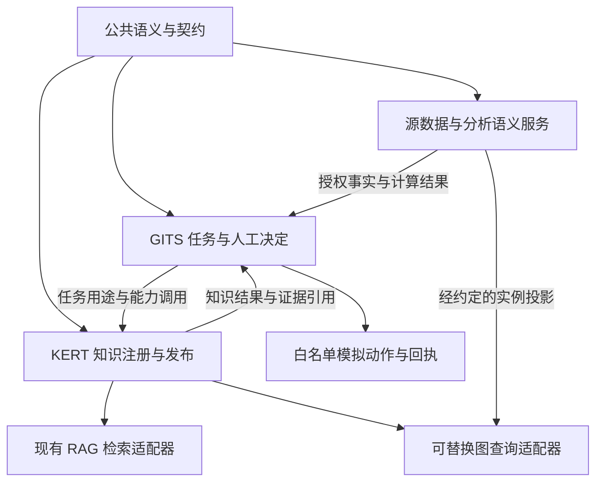
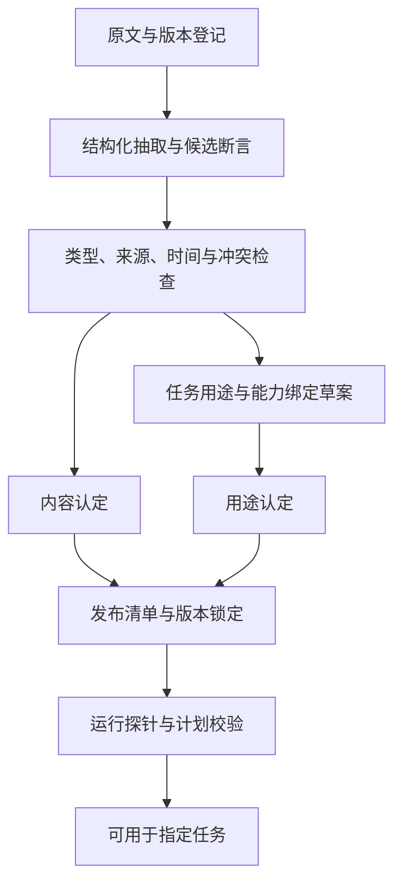

# GITS–KERT 对公访前准备与知识工程完整解决方案建议书

## 1. 方案决策摘要

**建议将项目建设为“面向对公经营任务、以证据为基础的专业准备与受控协作系统”。** 系统应帮助客户经理理解企业的经营方式，识别值得讨论的需求，核实影响判断的信息，形成有依据的拜访议程，并保存后续反馈。报告、指标、知识图和智能体都是实现这个目标的手段。

现有“14 项指标、4 条交叉验证、4 个能力”具有探索价值，但不能充当完整的业务模型。本方案重新定义业务流程、知识范围、指标体系、信号规则、能力合同、知识地图、数据模拟及验收机制，并保留已有 GITS/KERT 分工和传统 RAG 投资。

**最值得先完成的交付，是一条真实运行的 SIM 访前链路：客户定位 → 行业理解 → 客户经营与合作分析 → 信息缺口 → 产品条件对照 → 证据锁定 → 拜访议程与访前包。** 这条链路应真实使用已注册能力和受控数据，允许明确报告未知信息。它不需要先完成所有行业、全部指标或图检索框架。

| 决策主题 | 推荐选择 | 直接结果 |
|---|---|---|
| 业务组织 | 按拜访目标、客户阶段、行业、数据覆盖装配任务 | 不再让每个客户机械运行同一张指标表 |
| 专业分析 | 同时分析经营需求、服务机会和需要核实的风险 | 保持对公经营定位，避免退化为简化授信评分器 |
| 知识范围 | 建立行业、经营模式、客户事实、银行合作、产品条款、调查方法等知识域 | “知道什么”与“会做什么”都有具体载体 |
| 指标 | 采用公共指标目录、行业扩展和任务选集；恢复财务与现金流指标 | 可按口径复算，也能解释不适用和缺失 |
| 信号 | 分开事实冲突、经营变化、风险事件、需求机会 | 减少把口径差异误判为经营异常 |
| 产品 | 先解读及知识体检，再检查条件，最后形成受控候选 | 有证据的产品沟通准备，不输出正式准入、额度或定价决定 |
| 用户流程 | 保留 P12 缺口确认、P13 证据装配、P14 预览确认 | 人工能够改变证据和议程，修改后重新生成并留痕 |
| 语义与知识地图 | 公共语义统一对象；任务地图选择版本化资产、指标和能力 | 地图能够指导执行，不只是显示关系 |
| RAG / GraphRAG | 复用现有 RAG；图检索用于有收益证据的关系发现和主题综述 | 避免把可选算法变成所有任务的前置依赖 |
| 图引擎 | 保留旧 Kuzu SIM 的复现能力；长期实现通过独立 GraphQueryPort 更换 | 不再把已归档项目作为默认长期底座 |
| 交付 | 定义验收、运行验收、业务效果验收分开 | 文档齐全不能替代能力可用，诚实标注也不能替代运行证据 |

**本方案提出完整目标态，按阶段实施。** 首期仍限定 SIM 客户、对公客户经理岗位、访前准备场景和既有模拟动作白名单。新增行业、客户范围、历史数据规模和产品能力进入后续明确的范围增量。方案中的新字段、新状态和新规则是设计建议，需进入受控规格；本文不自动修改既有合同、QA 结论、发布状态或生产权限。

### 1.1 对当前交付的四项判断

| 原评审项 | 判断 | 本方案的处置 |
|---|---|---|
| 14 项指标合理、完整 | **部分成立** | 保留有价值主题，拆开复合指标，补财务、现金流与负债，按行业装配 |
| 4 条规则捕捉有效矛盾 | **部分成立** | 重做可比性前置和信号分类，增加合法解释、独立风险事件和机会规则 |
| 4 个能力已达到可验收标准 | **部分成立，仅具备定义框架** | 增加语义合格条件、具体规则内容、上下游契约和可观察的运行结果 |
| 当前 OC-04 可以关闭 | **不成立，现有材料不支持关闭** | 定义整改可先验收；OC-04 仍须有一条约定地图和所需能力的真实 SIM 运行证据 |

上述结论针对已提供的项目材料，不是对不可见仓库实现的代码质量判定。`DESIGN_ONLY` 的如实标注是正确行为；它说明实现尚未交付。

**阅读路径：** 项目 Owner 优先阅读第 1、3、14、15 章；业务与知识负责人重点阅读第 5–9 章；架构和实施团队重点阅读第 4、9–12、15 章。第 16 章逐项对应原调研问题，第 17 章列出来源与证据限制。

## 2. 研究依据与关键认识

本文以公开文件支持原理判断，以项目材料固定现有边界。除明确标为 **[公开依据]** 的事实外，业务分类、优先级、指标选集、SIM 数值、服务划分和验收目标均属于 **[专家建议]**，不是监管统一阈值，也不代表任何银行正式口径。

### 2.1 银行专业判断需要多类信息，不能仅看可抓取的行为数据

**[公开依据]** 《流动资金贷款管理办法》第十六条的尽职调查范围涉及公司治理、经营及投资计划、行业状况、真实财务、营运资金和融资等；其附件也以财务报告与业务预测支持资金需求测算。因此，以“可能粉饰”为由整体排除财务报表，没有充分依据。该规定用于贷款管理，本方案将其作为访前知识广度的参照，不把访前包等同于法定尽调报告。[《流动资金贷款管理办法》](https://www.nfra.gov.cn/cn/view/pages/ItemDetail.html?docId=1151066&itemId=925)。[^1]

**[专家建议]** 报表、流水、发票、订单、访谈都可能存在缺陷。正确方法是保留来源与口径、区分直接观察和推算、寻找独立证据，并在缺失时改变判断强度。既不能把银行流水当作完整经营收入，也不能把财务报表当作无需核查的真相。

### 2.2 访前经营与授信管理相关，但职责不同

**[公开依据]** 巴塞尔委员会 2025 年《信用风险管理原则》要求清晰的授信标准，并理解交易对手、融资目的、结构及还款来源，同时区分个人授信与组合层面的风险管理。它支持“判断有明确对象、职责和依据”，不支持将银行组合不良率直接当作企业经营指标。[2025 年信用风险管理原则](https://www.bis.org/publications/202504-guidelines-principles-management-credit-risk.pdf)。[^2]

**[专家建议]** 访前包应回答“可能有什么需求、需要核实什么、可以讨论哪些服务”；正式信用评级、授信审批、额度、利率及生产业务处理沿用银行权威系统。机会识别和风险核实共享证据，但不能相互替代。

### 2.3 名称相近不代表指标可比

**[公开依据]** 会计收入以履约和控制权转移等要求为基础，并非按银行入账金额直接确认；银行结售汇与银行代客涉外收付款也有不同统计对象和时点。[企业会计准则第 14 号](https://kjs.mof.gov.cn/zt/kjzzss/kuaijizhunzeshishi/201709/t20170907_2694006.htm)、[外汇局统计口径说明](https://www.safe.gov.cn/zhejiang/2025/1231/2302.html)。[^3][^4]

**[专家建议]** 营收、开票、实缴税款、经营回款、涉外收款、海关出口和结售汇分别建模。系统必须先证明比较条件成立，才能解释背离；缺乏同口径数据时，输出调查问题，不输出“矛盾事实”。

### 2.4 数据存在于社会系统中，不等于本项目已经可用

**[公开依据]** 2026 年“银税互动”通知明确了合作机制、数据范围、交换方式及企业授权范围和时限，并要求持续核验模型及多维数据。该文件还关注对开、环开等问题，说明涉税资料也需要核验。[税总纳服发〔2026〕19号](https://shanghai.chinatax.gov.cn/zcfw/zcfgk/nsfw/202604/t479916.html)。[^5]

**[专家建议]** 每项外部数据必须有可得性合同。“金税四期打通多部门”不能证明具体银行有权取得某企业社保、税额、海关或电力明细。SIM 中可以构造这些资料，但必须注明模拟可用性，不借此宣称真实接入已经成立。

### 2.5 行业信息用于解释机制，不能直接判定单一企业好坏

**[公开依据]** 国家统计局对 PMI 的说明涉及抽样、扩散指数和季节调整，其对象是相应调查总体，不是单一企业营收或违约概率。[2026 年 8 月 PMI 发布附注](https://www.stats.gov.cn/sj/zxfb/202608/t20260831_1965154.html)。[^6]

**[专家建议]** “行业景气下降”只能形成背景假设。必须进一步连接企业的产品、客户、地区、订单和现金循环；行业标签相同，不代表企业承受相同影响。

### 2.6 Palantir 的可借鉴之处是对象、逻辑和行动的统一约束

**[公开依据]** Palantir 将 Ontology 描述为连接数据资产与现实对象的运行层，包含对象、属性、关系，以及动作、函数和安全控制；Action Types 还包含对象变更逻辑及提交时的副作用。[Ontology 概述](https://www.palantir.com/docs/foundry/ontology/overview/)、[Action Types](https://www.palantir.com/docs/foundry/action-types/overview/)。[^7][^8]

**[专家建议]** GITS–KERT 应借鉴“围绕业务对象组织可执行能力”的方式，但仍按现有权威责任拆分系统。共享对象定义不意味着共享写权限，统一视图也不意味着复制一套客户主数据。

### 2.7 GraphRAG 不会自动形成可批准的知识或可调用合同

**[公开依据]** Microsoft GraphRAG 提供 Local、Global、DRIFT 等检索方式，Global Search 使用社区摘要支持全库主题问题；其项目说明同时提示索引提示词、领域概念和人工来源核验的重要性。LightRAG 的原始研究采用图与向量结合、双层检索及增量更新。[GraphRAG 查询说明](https://microsoft.github.io/graphrag/query/overview/)、[责任与限制说明](https://github.com/microsoft/graphrag/blob/main/RAI_TRANSPARENCY.md)、[LightRAG 论文](https://arxiv.org/abs/2410.05779)。[^9][^10][^11]

**[专家建议]** 两者可以帮助发现实体、关系、主题和证据线索。业务用途、执行前提、授权主体、失败行为和发布决定仍需要受控建模，不能从文本共现关系直接推导。

### 2.8 验收要证明实际场景中的有效性

**[公开依据]** NIST 生成式 AI 风险管理资料要求在接近部署的条件下评价能力、核验输出来源，并避免从狭窄或非系统性评估外推。BCBS 239 则强调风险数据的准确性、完整性和及时性。两者在本文中作为质量设计参照，不构成本项目已经合规的证明。[NIST AI 600-1](https://nvlpubs.nist.gov/nistpubs/ai/NIST.AI.600-1.pdf)、[BCBS 239](https://www.bis.org/publications/201301-guidelines-principles-effective-risk-data-aggregation-and-risk-reporting.pdf)。[^12][^13]

### 2.9 图数据库选型需要更新

**[公开依据]** Kuzu 官方仓库显示已于 2025 年 10 月 10 日归档；README 说明旧版本仍可使用，但扩展服务的获取方式发生变化。[Kuzu 官方仓库](https://github.com/kuzudb/kuzu)。[^14]

**[专家建议]** 既有 SIM 夹具可继续固定版本复现；新增长期建设不能默认依赖其持续维护。先固定图服务合同和可重建的数据，再按实际需求选择运行引擎。

## 3. 业务目标与完整用户流程

### 3.1 访前包必须回答的六个问题

1. **拜访谁、为什么现在拜访？** 明确企业身份、岗位、关系阶段、上次约定和本次目标。
2. **企业怎样赚钱、怎样用钱？** 说明商业模式、主要客户、供应方式、生产交付、收付款和资金周期。
3. **最近发生了什么？** 把企业变化、行业变化和本行合作变化分开，并解释是否可比。
4. **银行可能帮助什么？** 先提出具体经营问题，再关联结算、现金管理、代发、融资或跨境服务。
5. **哪些问题尚不能下判断？** 列出关键资料、冲突、证据不足及最值得询问的事项。
6. **本次具体谈什么、随后做什么？** 给出议程、非诱导提问、所需材料和经确认的跟进安排。

这里的“完整”是六个问题都得到回答或明确说明未知。它不要求所有企业都填满同样的指标，更不要求模型为每个维度编造结论。

### 3.2 任务模式

| 模式 | 主要目标 | 必需知识 | 应避免的扩张 |
|---|---|---|---|
| 新客初访 | 理解企业、建立沟通、发现需求 | 身份、行业、经营模式、基本服务能力、问题清单 | 用缺失的行内历史给企业打低分 |
| 存量客户例行拜访 | 解释变化、改善服务、兑现承诺 | 行内合作、近期经营、接触历史、产品变化 | 每次生成一份全套授信调查 |
| 融资需求访前 | 理解用途、现金循环和资料缺口 | 财务现金流、债务、用途、产品条款和调查要求 | 输出正式审批、额度或价格 |
| 事件触发拜访 | 核实具体变化和影响 | 原始事件、相关暴露、历史处置和确认状态 | 把所有事件自动上升为信用恶化 |
| 跨境或供应链专题 | 讨论特定业务问题 | 交易模式、账期、币种、链上角色、适用产品 | 无真实背景仍推销融资或衍生产品 |

**首期选择“存量客户的融资需求访前准备”一个模式。** SIM-C001 沿用既有范围；其他模式属于目标态模板，不自动激活。

### 3.3 人工可操作的三阶段

| 阶段 | 客户经理实际操作 | 系统持久化成果 | 退出条件 |
|---|---|---|---|
| P12 缺口确认 | 确认身份、拜访目标；处理缺失项；决定哪些问题留待现场询问 | TaskContext、GapChecklist、目标及适用范围版本 | 关键身份与权限明确；阻断项解决或按批准的降级方式处理 |
| P13 生成前证据装配 | 查看原文与指标口径；补充、排除、锁定证据；记录排除理由 | 服务端 EvidenceBundle、ContextPackage 及内容摘要值 | 证据包可复现，重要冲突未被悄悄删除，所选用途合法 |
| P14 访前包预览与确认 | 审阅分析、候选方向与话术；编辑并确认 | 与证据包绑定的 PrevisitPackage 和确认记录 | 禁止事项检查通过；确认者知道仍存在哪些缺口 |

一键访前可以自动执行资料搜集和初稿编排，但必须保留这三个可改变结果的操作阶段。P13 调整证据后，旧报告与新证据之间的确认关系失效；系统生成新版本，由 P14 对新版本确认。

### 3.4 首页的信息预算

**[专家建议]** 默认首页展示：本次目标、3 个主要发现、最多 3 个服务讨论方向、5 个优先问题，以及一个始终可见的重大事件区。6–8 个关键数值可作为摘要，其余内容展开查看。数量用于控制阅读负担，不作为业务完整性的判据；重大事件不能因 Top-K 限制被截掉。

同时提供内部视图和可对客使用的话术视图。内部中收、营销排序、风险假设及受限证据不直接进入客户可见材料。报告必须说明“为什么提出这项建议”“什么情况下它不成立”。

## 4. 系统边界与理论基础

### 4.1 权威责任

| 责任主体 | 定义和批准什么 | 保管什么 | 执行什么 |
|---|---|---|---|
| 公共语义核心 | 跨系统类型、身份、基本关系、兼容性和映射规范 | 版本化语义包与受控映射 | 类型、引用、兼容性校验；不直接决定业务事实 |
| 银行源系统 / 数据平台 | 源事实口径、授权数据产品；指标 Owner 批准指标 | 客户、账户、交易、已生效业务决定及时间版本 | 受控查询、指标计算、源事实更正 |
| KERT | 知识内容、产品条款解释、规则、地图用途及知识发布 | 来源、知识资产、断言、产品卡、规则包、地图和发布记录 | 检索、知识处理、条件核验及可调用知识能力 |
| GITS | 任务过程、岗位操作、人工经营决定和模拟动作授权 | 任务证据快照、访前包、确认、任务状态和回执 | 业务编排、证据锁定、人工交互、受控动作及恢复 |
| 图服务 | 按合同接受指定来源的投影 | 可重建的节点、边、来源和图快照 | 有界关系路径查询；不批准知识，也不修改客户事实 |

客户事实被装入任务证据包，是一次可追溯的读取快照。它不因此变成 KERT 的客户主数据，也不允许 GITS 按模型意见更改源系统。

### 4.2 五类对象不能混为一种“知识”

| 对象 | 例子 | 正确语义 |
|---|---|---|
| 源事实 / Observation | 某账户某日余额、某期报表数值 | “某来源在某时点提供了该值”；来源责任明确 |
| 陈述 / Claim | 企业介绍中声称订单增长；客户经理观察到停工 | 保留陈述者、时间、证据和核实状态，不直接当已验证事实 |
| 推导 / Inference | 在条件成立时可能存在回款压力 | 保留规则、输入、可比性、替代解释和不确定性 |
| 决议 / Decision | 知识认定、地图用途批准、业务人员选择跟进 | 保留授权角色、对象版本、范围与决定；不同决定分开 |
| 动作与回执 / Action、Receipt | 创建模拟跟进任务、记录接触结果 | 描述是否提交、接受、完成、失败或结果未知 |

“文档真实存在”“抽取忠于原文”“原文陈述客观正确”“该知识适用于当前任务”是四个不同问题。知识审核不能一次性把它们全部变成 TRUE。

### 4.3 本体、校验、分析语义与规则各自负责什么

**本体层**规定对象身份和关系含义，例如公司、集团、账户、产品、文档、断言、任务、能力及其关系。**分析语义层**规定数值的粒度、时间、币种、聚合和授权执行。**规则层**在明确前提下计算条件或输出信号。**工作流层**决定谁能确认、何时执行以及失败怎样恢复。

**[公开依据]** OWL 的开放世界语义意味着未记录某事实不等于该事实为假；SHACL 用于校验 RDF 图是否满足所定义的条件。[OWL 2 Primer](https://www.w3.org/TR/owl2-primer/)、[SHACL](https://www.w3.org/TR/shacl/)。[^15][^16]

**[专家建议]** 不使用“知识图里没有逾期”推导“客户没有逾期”。业务规则使用显式的 TRUE / FALSE / UNKNOWN，运行错误另行表示 ERROR。SHACL 或 JSON Schema 校验通过，也不证明断言客观真实或指标计算正确。

现有 GITS 的 semantic-runtime、OWL/SHACL、Jena 方向如已有实际基线，应复用并建立一致性映射；无需为了本次方案拆除。跨系统合同仍优先采用现有结构化定义和稳定 ID，只有需要 RDF 互操作时才增加对应投影。不能同时手工维护两份可独立修改的定义。

## 5. 知识范围与行业研究体系

### 5.1 建立十二类知识资产

| 类别 | 必须包含的内容 | 典型产物 | 更新与认定 |
|---|---|---|---|
| K01 客户身份与组织 | 企业 ID、集团、实控关系、业务分部、联系人角色 | 来源引用和实体解析结果 | 按源更新；身份冲突先解决 |
| K02 经营模式 | 产品、客户类型、渠道、交付、收入确认和收付款模式 | BusinessModelCard | 客户材料与有来源的访谈陈述；变更复核 |
| K03 行业与价值链 | 市场、竞争、政策、技术、上下游、盈利和资金周期 | IndustryPlaybook | 定期检查及重大事件触发；知识专家认定 |
| K04 财务与资金周转 | 报表、现金流、应收存货应付、债务、担保 | FinancialContext 和指标引用 | 绑定报表期间、审计状态、合并范围 |
| K05 本行合作 | 账户、结算、存款、代发、授信、服务使用、接触记录 | RelationshipContext | 源数据快照；不可推成企业全量数据 |
| K06 关系与事件 | 供应链、关联方、控制权、司法、经营许可及重要事件 | RelationView、EventRecord | 时间化关系与事件状态；不重复计数 |
| K07 产品与服务 | 条款、适用场景、条件、材料、互斥、例外和解释 | ProductCard、ClauseSet | 产品 Owner 或知识授权角色批准发布 |
| K08 调查与条件规则 | 财务定义、指标、信号、证据要求和适用条件 | MetricSpec、RulePack | 对应业务或指标 Owner 批准 |
| K09 沟通与需求发现 | 非诱导问题、岗位可回答范围、资料申请方式 | QuestionTemplate | 领域复核；评价提问是否可用 |
| K10 流程与能力 | 输入输出、阶段、调用方式、失败行为和责任 | TaskTemplate、CapabilitySpec | 规格与真实提供者显式映射 |
| K11 经验与案例 | 成功、失败、例外及反例；当时条件与结果 | CaseCard | 标注经验性质，禁止个案直接普遍化 |
| K12 模板与评测 | 访前包模板、标准案例、证据答案和评测规则 | ReportTemplate、EvaluationCase | 业务认定与测试集版本管理 |

“市场慧眼智能体”一类系统是知识提供者或上游能力，其回答仍须带来源和时间。不能因为来源是另一个 Agent 就视为权威研究结果。

### 5.2 推荐的产业研究八维模型

以下为重新设计的行业分析模型，不宣称它与 KERT 中尚未完整核对的 `KI-FRONT-002` 已有八维定义等价。应新建候选版本并逐维比较。

| 维度 | 要回答的问题 | 优先证据 | 转成客户访谈的方式 |
|---|---|---|---|
| D1 终端需求与周期 | 谁在买、需求驱动是什么、订单有何变化？ | 官方统计、订单、行业公开披露 | “近期订单变化主要来自哪些客户或用途？” |
| D2 价值链与交易模式 | 企业处在哪一环，谁供货、谁付款？ | 合同、供应链资料、企业披露 | 核实贸易角色、付款主体与账期 |
| D3 竞争与议价 | 差异化、替代品、客户集中及价格传导怎样？ | 客户结构、报价和公开竞争资料 | 讨论定价权与大客户条款变化 |
| D4 生产交付与技术 | 产能、交付、质量、外包和技术替代怎样？ | 产销、在手订单、交付记录 | 核实扩产、设备或交付节点需求 |
| D5 盈利与成本 | 毛利来源、成本敏感性和价格结构是什么？ | 分部财务、采购合同、价格数据 | 区分销量增长、涨价与利润改善 |
| D6 现金循环与融资 | 预付、库存、应收、应付及资金缺口如何形成？ | 财务、交易、账龄、债务计划 | 询问资金使用时点、回款和周转 |
| D7 政策、地域与关键约束 | 哪项政策、许可、环保或跨境因素会改变经营？ | 适用的正式文件、许可和事件 | 核实实际暴露，不用泛化政策口号 |
| D8 客户位置与银行服务 | 行业变化怎样作用于该客户，银行可解决什么问题？ | 客户事实、前七维、产品条件 | 提出有限服务假设及证伪问题 |

行业研究输出采用“**背景事实 → 影响机制 → 客户暴露 → 支持和反对证据 → 待核实问题**”结构。模型对某一维没有充分证据时，输出 NOT_ASSESSED；未受相关政策影响时输出 NOT_APPLICABLE，不能强制八维都有正负评级。

### 5.3 三类首选行业方案包

| 行业方案包 | 核心经营链条 | 条件性数据 | 常见合理解释 | 可能的服务问题 |
|---|---|---|---|---|
| 制造业 | 订单—采购—生产—交付—回款 | 产量、产能、库存、能耗、客户结构 | 设备节能、外包、产品升级、季节停工 | 采购备货、回款管理、设备更新、代发 |
| 贸易与流通 | 采购—库存/在途—销售—回款 | 进销存、订单、物流、海关、币种 | 总额/净额确认差异、代采、退货、跨期到货 | 结算效率、账期、应收、跨境收付 |
| 企业服务业 | 获客—签约—交付/验收—开票—收款 | 项目里程碑、续约、人力、合同资产 | 项目周期、外包、订阅预收、客户集中 | 代发、项目收款、现金管理、周转 |

用电量仅作为有适用性证明的生产代理变量。它不能成为服务业、贸易类企业的必填经营活力指标。服务业还应继续细分：订阅型、人力型、项目型的收入和资金逻辑并不一致。

### 5.4 知识质量及维护机制

每个行业方案包必须注明覆盖的业务子类、地区、观察期间、证据日期、适用前提、排除范围及下次复核触发条件。宏观信息、产品政策和客户事实可以具有不同更新频率，不统一设置一个“30 天有效”标签。

首期由知识负责人维护知识清单及关键原文，由业务负责人判断它是否帮助当前任务。产品条款变化、实控人变化、行业重大事件和数据源撤销均可触发影响分析；自动生成的是更新候选及受影响任务清单，原发布版本不被原地改写。

## 6. 指标与数据产品的完整设计

### 6.1 指标目录、任务选集、页面显示分开

**指标目录可以宽，单次任务应当窄，首页显示应更窄。** 指标目录回答系统理解哪些量；任务选集回答本次需要哪些量；首页回答哪些量最有助于现场沟通。不能用首页只能放 8 项，推导底层只能定义 8 项。

以下 M / I 编号是方案内的目录引用，不是已经注册的 metricId。正式落地时为新增定义分配受控 ID；已有 `SIM.METRIC.CUSTOMER_AVG_DEPOSIT@1.0.0` 保留其批准口径。原“14 项”中包含指标主题、事件类别及复合口径，需要拆分。

### 6.2 公共指标目录

金额指标须声明币种、金额单位及计量范围；“月”均指已完结的自然月，未完结月份须单独标注 MTD，不能冒充整月。报表类指标须注明单体/合并、期间、版本和来源状态。

| 编号 | 指标 | SIM 定义或计算要求 | 用途与限制 |
|---|---|---|---|
| M01 | 营业收入 | 企业报表期间的收入；按报表确认基础读取 | 经营规模；不得由账户入账替代 |
| M02 | 净利润 | 同一报表主体、期间的净利润 | 盈利情况；与现金流联合看 |
| M03 | 资产总额 | 企业报表期末资产 | 比率分母及规模；不是可用现金 |
| M04 | 负债总额 | 同一报表期末负债 | 包含经营性负债；不等于融资余额 |
| M05 | 资产负债率 | M04 / M03；资产≤0 时不返回普通比率 | 只按行业及资本结构解释，不设全行业统一准入线 |
| M06 | 经营活动现金流量净额 | 同期现金流量表中经营活动净现金流 | 不由本行单一账户净流入替代 |
| M07 | 应收账款余额 | 期初、期末分别读取；区分账面与净额 | 资金占用；不得混入无关合同资产 |
| M08 | 应收账款周转天数 | 平均应收 / 同期赊销收入 × 期间天数 | 无赊销收入时可另定义营收代理版，明确标 PROXY，不能同 ID 静默替换 |
| M09 | 存货余额 | 同口径期初、期末存货 | 制造、贸易常用；部分服务业不适用 |
| M10 | 存货周转天数 | 平均存货 / 同期营业成本 × 期间天数 | 成本≤0 或期初缺失则不可计算 |
| M11 | 应付账款余额 | 同口径期初、期末应付 | 分析供应商信用支持 |
| M12 | 应付账款周转天数 | 平均应付 / 同期赊购金额 × 期间天数 | 若只能用成本代理，另立定义并暴露限制 |
| M13 | 现金转换周期 | M08 + M10 − M12；三者使用兼容口径 | 可为负；不能因负值直接判断有错误 |
| M14 | 可用现金余额 | 按所声明覆盖范围，扣除冻结、质押等受限部分 | 若仅本行可见，明确为“本行可见可用现金” |
| M15 | 未来 90 日到期债务本息 | 在任务截止时点已知的付款计划，按到期日汇总 | 区分本行与全机构覆盖；不计未经确认的续贷 |
| M16 | 客户日均存款 | 先按账户日取唯一日终余额，再按客户日汇总，除以自然日数 | 沿用既有 30 天/CNY SIM 口径，不外推正式银行规定 |
| M17 | 本行可识别经营收款 | 按批准分类器识别经营收款，排除冲正、自转、借款等 | 分类覆盖率与未分类金额同时返回；不是企业总营收 |
| M18 | 本行可识别经营付款 | 同 M17 的方向对应口径 | 不把净额与总额混用，不把对外划转自动当采购 |
| M19 | 本行代发覆盖人数 | 当期成功代发的去重员工标识数，定义退款与补发处理 | 与社保人数比较时需说明同主体、月和人群覆盖 |
| M20 | 本行代发金额 | 成功代发金额减对应撤销；同一工资所属期 | 奖金、补发、税前税后必须注明 |
| M21 | 授信使用率 | 同一额度池内已占用额度 / 当时有效额度 | 循环、共享和产品子限额不重复相加；分母为零返回不适用/异常原因 |
| M22 | 逾期本金余额 | 源系统在截止时点认定的未偿逾期本金 | 关联合同、到期日、事件状态；不由 LLM 推测 |
| M23 | 欠息余额 | 源系统在截止时点认定的未偿欠息 | 与逾期本金分开；不能合并为模糊“风险分数” |
| M24 | 前五大收款对手占比 | 观察窗口内前五对手合格经营收款 / 全部合格经营收款 | 默认是本行观察集中度；集团合并口径另定义 |
| M25 | 前五大付款对手占比 | 同 M24，改为经营付款 | 图提供实体关系，指标服务负责金额和分母 |
| M26 | 本行中间业务净收入 | 批准收费归属口径下的收入减冲销/返还 | 内部经营分析使用，不作为客户风险事实 |
| M27 | 票据发生额 | 指定业务类型、期间内唯一票据事件的发生额 | 开立、贴现、承兑等分别取业务类型，不能直接累加为统一风险量 |
| M28 | 票据期末余额 | 指定业务类型、截止日有效未结清余额 | 存量与发生额分开，去除同一票据重复链路 |
| M29 | 可见融资性负债余额 | 按融资合同唯一键汇总，标明本行/授权跨行覆盖 | 未取得跨行授权时不能声称“全口径负债” |
| M30 | 可见对外担保责任余额 | 按有效担保合同及责任范围去重汇总 | 不把同一担保链的每条边重复计作敞口 |

### 6.3 行业和数据条件扩展

| 编号 | 指标 | 适用条件 | 必须分开的概念 |
|---|---|---|---|
| I01 | 净开票金额 | 有授权发票资料，已处理红冲作废，明确含税/不含税 | 开票日期与收入所属期 |
| I02 | 实缴税款 | 有授权税务数据，按税种、缴款期间读取 | 实缴、应缴、退税和税负率 |
| I03 | 社保缴纳人数 | 有授权、同一法人和所属月份 | 集团人数、参保人数、在岗人数 |
| I04 | 生产用电量 | 生产与计量边界已知且可比 | 外购电、自发电、外包生产和单位产量能耗 |
| I05 | 新增有效订单金额 | 已确认订单，取消和变更可追踪 | 意向订单、框架协议和实质订单 |
| I06 | 未交付有效订单金额 | 截止时点有效订单减已交付/取消部分 | 在手订单与当期收入 |
| I07 | 产能利用率 | 产量与有效产能为同单位、同工艺口径 | 设计产能、有效产能及设备开工率 |
| I08 | 海关出口金额 | 企业角色、报关时点和币种已明确 | 代理出口、本企业销售和外汇兑换 |
| I09 | 跨境经营收款 | 有业务分类、境内主体和收付时点 | 全部跨境流入与贸易经营收款 |
| I10 | 结汇金额 | 银行结汇成交记录及币种转换口径 | 出口额、收汇额和结汇额 |
| I11 | 可见渠道销售收款 | 零售/平台等渠道已接入且覆盖明确 | 本渠道 GMV、退款净额、企业会计收入 |
| I12 | 续约率 | 订阅服务的到期合同 cohort 可识别 | 按客户数续约率与按金额续约率分别定义 |

展期、涉诉、被执行、实控人变动、环保处罚、许可变化等进入 **EventRecord 事件目录**。每项带事件类型、主体、时间、金额（如适用）、状态、原始记录和当前影响，不继续塞进一个复合数值指标。

### 6.4 每项 MetricDefinition 的最低合同

| 合同组 | 必需信息 |
|---|---|
| 身份 | metricId、版本、业务名、Owner、状态、内容摘要值 |
| 对象与粒度 | entityType、主体范围、分组键、去重键、关联基数、允许聚合方式 |
| 时间 | periodStart、periodEnd、闭开区间、calendar、timezone、asOf、availableAt |
| 计算 | 公式、分母、分类条件、舍入位置、缺失处理、零分母与负值处理 |
| 单位 | currency、amountUnit、汇率来源与日期；比率/百分点区分 |
| 数据 | 授权数据产品、覆盖范围、来源版本、完整性与新鲜度要求 |
| 执行 | 查询模板或对象 API、可用参数、权限、资源限制、结果和复算追踪 |

执行固定为：**解析业务意图 → 解析批准的 metricId → 校验用途及授权 → 编译受控计划 → 查询 → 复算与解释**。LLM 可以提出候选查询需求，不能自行拼表绕过批准口径。

日均存款的样例验收必须保留“多账户但分母仍为自然日数”“交易一对多关联不放大余额”“相同数值的合法不同账户余额仍须相加”。`SUM(DISTINCT balance)` 不满足去重语义，不能作为补救关联放大的实现。多币种、缺日、账户归属变化沿用当前批准的拒绝策略，后续支持时新发指标版本。

### 6.5 不可得信息的业务处理

每个数据产品需要 `availability / authorization / coverage / freshness / retrievalOutcome`，这些维度分别表达可得性、授权、覆盖、新鲜度与本次获取结果。不得用一个 `missing=true` 代替全部原因。

业务值可以是 KNOWN、UNKNOWN、NOT_APPLICABLE；执行结果可以是 SUCCESS、PARTIAL、FAILED、NOT_RUN。没有执行过的“无冲突”与检查成功且未发现冲突必须区分。缺数据不会自动给客户减分，而是影响判断可支持的范围和资料请求。

## 7. 信号、解释与处置规则体系

### 7.1 四类结果

| 类型 | 定义 | 例子 | 允许的后续 |
|---|---|---|---|
| FACT_CONFLICT | 同主体、同概念、同期间等可比前提下，资料出现不能同时成立的值或陈述 | 两份同版本报表同一科目不同值 | 回源核实、保留双方证据；不静默取平均 |
| BUSINESS_ANOMALY | 与基线、季节性或可解释关系明显不同的观察 | 可比期间回款下降、账龄拉长 | 提出假设、替代解释、资料与问题 |
| RISK_EVENT | 权威来源记录的事件或受控规则产生的风险关注事项 | 已认定的逾期、被执行事件 | 展示事件及适用处置规则；与正式认定和处置状态分开 |
| OPPORTUNITY | 有客户经营依据、尚待确认的服务需求 | 新增员工而现有代发覆盖较低 | 准备讨论方向与条件核验，不自动销售 |

营收上涨而纳税下降一般不能直接构成 FACT_CONFLICT。两者可能分别真实，关系受到税种、税收优惠、扣除、结算和时点影响。只有对相同事实的明确矛盾，才使用“事实冲突”。

### 7.2 统一规则执行顺序

1. 校验实体匹配、口径、窗口、单位、授权及数据覆盖。
2. 判断行业和业务模式是否适用；不适用则停止该规则。
3. 对齐期间，处理季节性、基数及结构变化；不能对齐则返回不可比较。
4. 执行批准的公式、阈值和条件，生成候选信号。
5. 检查已有的合理解释及反证，区分“解释已验证”与“仅有解释假设”。
6. 生成带证据、条件、优先级和下一步的结果；执行权限独立检查。

一个 RuleSpec 必须包含 `appliesWhen、requiredInputs、comparability、window、baseline、predicate、thresholdProfile、explanations、outcome、priority、dedupKey、cooldown、failureBehavior`。规则本身可精确执行，不意味着它已被证明有真实银行风险预测能力。

### 7.3 推荐的规则族

| 编号 | 规则族 | 必需前提 | 输出及抑制逻辑 |
|---|---|---|---|
| R01 | 同事实一致性 | 同主体、概念、有效期、单位和版本语义 | 冲突定位；来源有明确替代关系时优先使用新版但保留旧证据 |
| R02 | 收入、开票与税款解释 | 收入—开票需可调节口径；税款单列税种与期间 | 两条分析支路，不能“纳税/开票”混算；有确认的优惠/跨期证据则解释，不指控造假 |
| R03 | 收入、经营回款与应收变化 | 企业收入与本行观察范围明确，至少有可比窗口 | 回款或渠道变化待核实；没有跨行资料不能认定“他行分流” |
| R04 | 用工与代发覆盖变化 | 人数对人数、工资对工资；同工资所属期 | 识别覆盖变化或服务机会；奖金与补发不会自动触发人数矛盾 |
| R05 | 产量、能耗与收入变化 | 适用制造业务，生产边界、产品组合和外包可解释 | 生产代理信号；节能、外包、结构变化为解释候选 |
| R06 | 增长与营运资金占用 | 财务窗口一致，应收、存货周转可计算 | 识别“增长占款”讨论方向；不自动推算可授信额度 |
| R07 | 近期到期与资金安排 | 可用现金、已知付款计划及其覆盖相容 | 资金安排缺口提示；未确认续贷和口头承诺不得计入确定现金 |
| R08 | 逾期/欠息事件与额度占用 | 事件有效，源版本和状态明确 | 逾期单独触发关注；高使用率只是附加严重性信息 |
| R09 | 历次承诺和待办到期 | 有实际承诺者、内容、到期日和状态 | 形成跟进议程；把客户未回复与确认违约分开 |
| R10 | 对手集中与外部事件 | 对手解析明确；集中度来自同一观察范围 | 显示暴露路径；集团关系不等于发生担保代偿 |
| R11 | 控制权/经营许可变化 | 事件身份、有效日期与来源可核验 | 提示更新资料；正常重组或名称变更不自动判为信用恶化 |
| R12 | 客户需求与服务覆盖 | 真实业务量、现有服务覆盖、明确客户需求或待核实假设 | 给出服务讨论方向；不得只按本行中收排序 |
| R13 | 跨境收付与币种敞口 | 贸易角色、币种、收支及期限明确 | 询问结算和风险管理需求；不承诺对冲收益或直接下单 |
| R14 | 产品条件与证据有效性 | 产品条款、规则和证据版本均已固定 | 输出条件矩阵、资料缺口或候选排除；不输出正式审批 |

### 7.4 首条 SIM 链路的可执行参数包

下面数值是 **测试行为所需的专家建议参数**。它们不是行业公认预警阈值。参数包必须版本化，明确适用的 SIM 行业和数据集。

| 参数项 | 推荐的首轮 SIM 设置 | 为什么这样设置 |
|---|---|---|
| 截止时间 | 每次任务固定 `asOf`；禁止使用之后才发布的资料 | 防止“预测”使用未来信息 |
| 月度观察 | 最近 3 个完整月；同比需存在上年对应月份 | 有一定平滑；只有 30 天数据时不启用同比规则 |
| 一般趋势阈值 | 相对变化 ±20%，且基期金额≥10 万元；人数基期≥20 人 | 避免小基数夸大；仅为 SIM 初始值 |
| 周转恶化 | 应收周转增加≥15 天，且相对增幅≥20% | 同时考虑绝对变化与相对变化 |
| 授信趋满 | 同额度池使用率≥90% | 仅描述占用，不单独定义逾期或违约 |
| 逾期事件 | 本行权威 SIM 事件有效、逾期本金>0 或欠息>0 | 不依赖授信使用率，避免漏掉低占用逾期 |
| 机会规则 | 经确认同主体员工≥100、代发覆盖<50%，并有授权需求资料 | 生成代发沟通假设；未知覆盖不能当 0% |
| 去重 | 相同客户、规则、观察窗口及主要证据合并 | 不把同一新闻多次转载生成多个关注事项 |

R01、R03、R06、R08、R12、R14 作为首条 SIM 地图的规则子集。其他规则先形成明确定义和反例，按行业与数据覆盖启用。对于已确认的重大事件，去重只合并展示，不删除追踪责任；冷却期内如果事件状态或重要证据变化，必须重评。

### 7.5 六个业务验收案例

| 案例 | 已知输入 | 正确结果 | 不允许的结果 |
|---|---|---|---|
| E01 增长占款 | 同口径收入增长 25%，应收周转由 60 天到 90 天，现金流转负 | 经营异常与周转需求假设；询问账期、客户和回款 | 直接给贷款额度；称“企业造假” |
| E02 合法税务差异 | 营收增长，实缴税款下降；有覆盖该期间的有效优惠证据 | 解释税款变化；保留其他未核实因素 | 不经税种和期间核对便报“营收不实” |
| E03 能源边界变化 | 用电下降，外包生产增加且有依据，收入增长 | 标明原能耗代理失去可比性 | 将用电下降等同停产 |
| E04 低占用逾期 | 使用率 35%，源系统存在当前逾期事件 | 仍显示逾期及需核实事项 | 因使用率未满而不显示 |
| E05 代发机会 | 同主体员工 120 人，本行覆盖 36 人，需求授权有效 | 覆盖率 30%，生成代发沟通方向 | 将未覆盖 84 人全部认定为可营销个人 |
| E06 无法判断 | 本行回款下降，企业财务和其他银行资料均不可得 | 说明本行观察变化，提出渠道核实问题 | 确认“企业营收下降”或“已流失到他行” |

### 7.6 自动提示、人工决定与误报控制

可以让确定性规则自动产生内部关注事项，但必须由事先批准的处置合同限定其类型和流向。正式风险认定、调整评级、冻结额度或停止支付等不由本系统自动执行。**生成提示、投递、接收、确认、处置、关闭分别记录**，不能把报告中出现“已预警”视为履行处置责任。

误报控制采用可比性过滤、行业规则、原始来源去重、解释核验和信息预算。不能仅靠提高阈值降低误报，因为这可能同时提高漏报。合法解释只有在资料支持、范围适用且有效期匹配时才降低相应信号；LLM 自己提出一个可能解释，不足以关闭关注事项。

规则需要分类型评价命中质量和漏报。举例：若目标事件占比仅 1%，识别率 90%、误报率 5%，则命中提示中真正目标事件约占 15.4%。这是基数效应的算例，不是项目实测数据；它说明不能只报告“准确率”或负例通过率。

## 8. 产品解读、条件对照与受控推荐

### 8.1 产品知识必须先能解释和核查

每个 ProductCard 至少包括：正式产品标识与版本、服务类型、可解决的问题、适用客户、业务用途、材料清单、条件条款、例外条件、互斥关系、生效期、来源定位、解释文本及发布状态。产品名称相同但版本不同的条件不可拼接。

产品知识体检检查：条款缺失、旧新版本冲突、来源失效、条件无法计算、互斥关系无对象、对客解释超出原文。体检未通过的产品可以作为“知识待完善项”可见，但不能进入可执行候选判断。

### 8.2 条件核验与正式准入分开

建议将能力边界澄清为：允许依据批准规则形成“**当前证据下某项条件满足 / 不满足 / 未知**”；禁止形成正式银行客户准入、授信审批、额度承诺或定价决定。

如果现有合同中的“不产生准入结论”被解释为连条件判断也禁止，应先明确上述语义差异，不通过改一个展示名称暗中扩大权力。

| 条件结果 | 推荐处理 | 例子 |
|---|---|---|
| TRUE | 在当前证据范围内该条件满足 | 产品要求的企业存续期限已由正确身份资料证明 |
| FALSE | 该候选在本次模拟筛选中排除，保留理由 | 本次用途不在条款允许范围内 |
| UNKNOWN | 不给出“条件已满足”结论，转成资料缺口 | 缺少真实交易背景资料 |
| ERROR | 停止该候选判断，报告执行问题 | 规则版本丢失、引用冲突或计算失败 |

推荐排序仅在允许的候选集合中执行。先考虑客户已确认目标、业务适配、证据充分性、服务成本与实施难度，再考虑本行经营价值；明确排序依据。不要为凑齐三个候选展示不适用产品，也不要把 LLM 自评分当校准后的成功概率。

### 8.3 一份可以实施的 SIM 条款示例

下面“演示产品 A/B/C”只用于说明目标合同，不覆盖现有 SIM-P001 等产品定义。落地时应在受控产品版本中明确采用或映射。

| 演示产品 | 服务问题 | 明确的 SIM 条件 | 输出与边界 |
|---|---|---|---|
| A 周转融资准备 | 已识别经营周转需求 | 主体匹配；用途为经营周转；所需财务材料有效；当前本行逾期/欠息为零；用途证据非 UNKNOWN | 条件对照及材料清单，不输出额度、承诺或正式授信通过 |
| B 应收融资准备 | 确定交易产生的回款等待 | A 中适用的基础条件；存在已确认应收及交易背景；权利归属可核验；同一应收没有本次规则禁止的重复融资 | 逐条核验；没有登记/证据就不能把“未见重复融资”判 TRUE |
| C 代发服务沟通 | 企业希望改善工资发放 | 主体和授权明确；存在工资发放需求；服务地区/币种符合该 SIM 条款 | 讨论流程和材料；不导出员工个人营销名单 |

互斥必须描述对象与条件，例如“同一笔应收不得在本次方案内重复作为两项冲突融资的基础”，而不是笼统地写“A 产品与 B 产品永远互斥”。异常事件是否阻断某产品，必须由产品规则决定；不能因为融资候选受限，自动禁止所有结算或服务沟通。

### 8.4 对客话术验收

“客户可回答、禁止诱导”应转换成可复核的具体标准：问题针对明确角色可掌握的业务事实；一次主要询问一件事；不预设违法、经营恶化或产品适合；不要求对方确认未经证明的数字；说明需要何种资料。

合格示例：“最近三个完整月，本行可见经营收款较比较期下降。是否发生了收款渠道、主要客户账期或结算方式变化？”不合格示例：“贵司营收下降是因为客户流失吧？”

自动检查可发现禁止承诺、无依据数字、角色错误和明显预设结论；可回答性、礼貌和业务价值仍需有准则的人工抽样评价。不能宣称一组关键词检查已经穷尽语言边界。

## 9. 能力分工与可验收接口

### 9.1 十项逻辑能力

下表定义逻辑能力，不要求新建十个 Agent、十个服务或十个仓库。可在现有 KERT Python Core 和 GITS 服务中模块化实现，通过现有公共 HTTP / SkillExecutionPort 访问；不得直连 KERT 内部工作区。

| 编号 | 能力与责任 | 输入 | 输出 | 实质验收 |
|---|---|---|---|---|
| CAP-01 | 客户与事实装配；GITS 发起，数据平台供数 | 客户、任务、用途、权限、截止时间 | FactContext、MetricResults、覆盖说明 | 身份一致、正确聚合、时间与授权准确；不把未知补零 |
| CAP-02 | 行业研判；KERT | IndustryProfile、客户经营模式、有效资料 | IndustryBrief、适用机制、未知项 | 行业背景有依据，作用于客户的推论有桥接事实和反证 |
| CAP-03 | 供应链与关系理解；KERT | 主体、已获准关系、查询模板和图快照 | 有界 RelationView、路径来源和覆盖 | 支付关系不冒充贸易关系；同名不合并；集中度可复算 |
| CAP-04 | 事实对账与信号；KERT 调用受控规则 | FactContext、MetricResults、RulePack | ConflictCases、Signals、EvaluationTrace | 区分不可比、冲突、异常、事件和机会；合法解释被保留 |
| CAP-05 | 业务信息缺口；KERT | 任务、客户背景、完整规则执行结果和产品材料要求 | GapChecklist、优先级、QuestionPlan | 必要缺口不漏；问题对象正确；失败不当“无缺口” |
| CAP-06 | 产品解读与知识体检；KERT | 固定产品版本、条款及用途 | ProductInterpretation、HealthReport | 条件忠于原文，旧新版不混用，不完整知识不可用于筛选 |
| CAP-07 | 产品条件与候选；KERT | 通过体检的产品、需求、证据、RulePack | ConditionMatrix、CandidateSet、排除与未知理由 | 硬条件可执行；全未知不进入“条件已满足”；无正式审批输出 |
| CAP-08 | 拜访议程与承诺整理；KERT | 目标、行业、信号、缺口、历史承诺、候选方向 | VisitAgenda、QuestionPlan、待办建议 | 问题有业务价值、可回答、不诱导；历史未完成承诺可见 |
| CAP-09 | 证据锁定与报告；GITS 负责过程，KERT 可生成叙述 | 选定证据、全部能力结果、模板 | EvidenceBundle、ContextPackage、PrevisitPackage | P12/P13/P14 真正改变结果；报告与锁定证据一一对应 |
| CAP-10 | 模拟跟进；GITS | 已确认行动及对应上下文 | ActionReceipt、任务及反馈 | 仅白名单、逐动作确认、幂等、超时可对账 |

首期地图必须真实覆盖 CAP-01、CAP-02、CAP-04–CAP-09 的适用功能。CAP-03 在供应链路径被声明为必需时必须可运行；普通融资访前可使用已核实的一跳关系列表，不能声称已经实现多跳图能力。CAP-10 在 L4-2 验收。

### 9.2 与已有七个 Skill 的迁移关系

| 已有文档技能 | 目标能力 | 迁移要求 |
|---|---|---|
| bank-front-supply-chain-graph | CAP-03 | 对齐关系类型、查询边界、证据和实际提供者 |
| bank-front-eight-dimension | CAP-02 | 对比新八维定义；不能按名称自动认定内容相同 |
| bank-front-fact-reconciliation | CAP-04 | 增加比较前提、信号分类、窗口与规则执行结果 |
| bank-front-commitment-script | CAP-08 | 分开历史承诺、沟通问题和新行动建议 |
| bank-front-kyc-gap-check | CAP-05 | 指定业务尽调信息模式，避免冒充法定反洗钱 KYC 完成 |
| bank-front-product-recommendation | CAP-06 + CAP-07 | 分开知识体检、条件核验和候选排序 |
| bank-front-report-assembler | CAP-09 | 接受服务端锁定证据，保留 P12/P13/P14 |

代码中的 `skill-customer-*` 与文档 `bank-front-*` 必须逐个建立 `legacyId → canonicalCapabilityId → providerId → version → endpoint → schema` 映射。文档存在、包可以加载、代码有同名字符串，都不是实际语义兼容的充分证据。

### 9.3 能力间传递的是结果合同

建议统一的逻辑结果包包含：`taskId、entityId、purpose、asOf、capabilityId/version、inputDigest、status、result、evidenceRefs、limitations、ruleTrace、providerVersion、executionId`。这是语义要求；若既有受保护执行合同不允许新增字段，使用经审查的领域载荷或版本化扩展，不直接修改通用 envelope。

以事实对账到信息缺口为例：

| 上游字段 | 下游用途 | 缺失或异常时的行为 |
|---|---|---|
| taskId / entityId / asOf | 保证对账与缺口属于同一次任务 | 不匹配则拒绝消费 |
| evaluationStatus | 区分检查已做、失败或未执行 | FAILED/NOT_RUN 不能当无冲突 |
| evaluatedRuleIds | 说明哪些规则实际覆盖 | 必需规则缺失则返回覆盖不足 |
| conflictCases / signals | 生成需要核实的问题 | 空数组只在成功覆盖相应规则时表示“未发现” |
| comparedMetricRefs | 回到可比口径和数据结果 | 无版本或粒度则不能引用该结论 |
| evidenceRefs / explanations | 给客户经理提供核实依据及替代解释 | 无依据的解释保留为假设，不关闭问题 |
| requiredQuestions | 已知必须询问的事项 | 下游可改措辞，不得无理由删除必需问题 |

`optional: [conflictCases]` 只能说明结构可以省略字段，不能说明业务接口已闭合。下游必须知道上游是否成功运行、覆盖了什么，以及为什么没有冲突列表。

### 9.4 能力验收采用四层证据

1. **结构层**：字段、类型、枚举、版本和引用合法。
2. **语义层**：指标含义、规则前提、条款解释、问题质量符合业务标准。
3. **运行层**：对应实现被真实调用，产生可检查的结果与失败行为。
4. **任务层**：结果被下一能力消费，最终帮助客户经理完成既定准备任务。

结构和变异测试有价值，但不能证明测试所表达的业务标准正确。健康检查也不能只验证 HTTP 200；至少使用一个已知语义样例检查输入、结果、证据及失败状态。知识内容、模型行为和确定性数值计算分别验收，避免用一个总分掩盖问题。

## 10. 知识注册中心与三种地图

### 10.1 注册中心是可发现、可追踪和可停用的能力目录

注册中心不接管客户主数据。它维护资产和能力的身份、版本、责任、来源、适用范围、发布情况、接口与运行依赖，让任务编排能够找到正确版本，并判断当前能否使用。

| 注册对象 | 最低内容 |
|---|---|
| Source / SourceVersion | 原文地址或受控存储引用、内容摘要值、发布/获取时间、权利与用途 |
| EvidenceSpan | 来源版本、页/段/表格坐标、文本或数据定位、抽取方法 |
| KnowledgeAsset / AssetVersion | 类型、知识域、内容、Owner、适用时间、来源、状态 |
| Assertion / RulePack | 命题或规则、限定条件、证据、冲突、版本、责任 |
| Metric / Query | 对象粒度、计算口径、授权数据产品、模板与消费者 |
| Capability / Provider | 输入输出、前提、失败、允许用途、实现映射、运行探针 |
| TaskTemplate / MapSpec | 业务目标、必需与可选节点、路由、绑定、降级和预算 |
| ReviewDecision / Release | 审批对象版本与摘要值、用途、角色、生效范围、撤销记录 |
| EvaluationCase | 测试输入、应有及禁止结果、证据答案、评测版本 |

### 10.2 三种地图分别回答不同问题

| 地图视图 | 核心问题 | 节点 / 边 | 权威限制 |
|---|---|---|---|
| 内容知识图 | 某概念、资料和断言之间有什么关系？ | 概念、来源、断言；支持、反对、引用、适用于 | 边可以是候选，必须有来源和状态 |
| 任务知识地图 | 完成本任务需要哪些知识、指标和能力？ | 任务、资产、规则、能力；需要、产生、满足、绑定 | 只能引用批准范围内的版本及真实提供者 |
| 运行依赖图 | 本次调用依赖哪些服务和制品？ | 提供者、端点、模型、索引、规则包；依赖、调用 | 状态由实际运行证据更新，不由文档宣称 |

它们可以投影到图引擎中展示和查询，但不需要各自维护一套可独立修改的同义定义。

### 10.3 地图应可编译为有约束的执行计划

任务地图必须定义：目标、适用客户/岗位/用途、输入、必需与可选节点、能力提供者及版本约束、输入输出绑定、分支条件、失败策略、数据权限、预算和预期成果。

推荐计划编译过程：

1. 根据 TaskTemplate 解析意图，选择批准的地图版本；多个同优先级匹配结果则返回 ROUTE_AMBIGUOUS。
2. 根据任务范围，选择行业方案包和指标子集。未声明的业务模式不自动套用最近似模板。
3. 解析资产、产品、规则、能力的精确版本；验证权限、用途、有效期和依赖。
4. 检查必需能力的语义探针与依赖；必需能力不可用则阻断。可选分支只有在 MapSpec 明确允许时才能省略，并标明原因。
5. 生成受控 DAG、端口绑定、查询模板及预算，固化 ActivationPlan 和计划摘要值。
6. 执行时逐步检查参数与结果，重要引用撤销或失效后重新规划，不悄悄换用另一个版本。

同一份**已经固定的任务意图、证据、权限、版本、配置和运行依赖快照**应得到同一计划摘要值。不能把这一要求扩张为“任何随机生成文本都必须逐字相同”；生成内容要记录模型、提示词、解码配置及实际制品，供回放与解释。

### 10.4 状态分维度管理

| 状态轴 | 例子 | 不能推导的其他状态 |
|---|---|---|
| 内容认定 | CANDIDATE、CONTENT_ACCEPTED、REJECTED | 内容正确不等于适用于任意任务 |
| 用途认定 | USE_PENDING、USE_APPROVED、USE_REJECTED | 用途批准不等于实现已经存在 |
| 发布状态 | UNRELEASED、RELEASED、WITHDRAWN | 已发布不等于当前依赖健康 |
| 实现状态 | DESIGN_ONLY、IMPLEMENTED_SIM | 实现存在不等于业务验收通过 |
| 本次运行状态 | READY、DEGRADED、UNAVAILABLE | READY 只对规定环境、时间和探针范围成立 |

这些名称是目标语义，不要求替换既有枚举。现有 `status=VALIDATION` 的地图可以依已批准映射形成受限 SIM 候选投影；不能仅凭这个状态直接认定内容、用途和执行能力都已批准。

### 10.5 从非结构化文档自动构建可用地图

自动化流水线执行九件事：文档分类和切分；实体候选识别；名称消歧；断言、条件和否定词抽取；时间和单位标准化；来源级去重；冲突发现；映射到公共类型；生成候选任务引用及审核包。

LightRAG 可以参与抽取、关系发现或检索，但**任务地图的执行骨架来自批准的任务模板和能力合同**。文档中提到“可提供融资服务”，不足以创建可执行的贷款工具；文档描述流程，也不能证明系统已经具备对应能力。

### 10.6 审核应集中在业务差异，而非重新读整包

ReviewPackage 应并列显示：原文定位、抽取结果、上个版本、本次差异、冲突、受影响规则/地图、建议用途、测试结果和审批对象摘要值。

首期发布的全部关键产品条件、主体识别和影响判断的断言应逐项审阅；低风险背景说明可采用有界抽样。角色可以由被正式授权的主体履行，但不得通过多个 AI 会话名称伪造独立审批人。业务反馈进入候选更新队列，不自动把模型回答或客户未核实陈述升级为正式知识。

内容批准绑定 AssetVersion，地图用途批准绑定 MapSpec 和确切依赖集合；发布清单绑定两者的摘要值。审批后内容变化，必须产生新版本和对应复核范围。撤销时根据反向依赖定位地图、索引、缓存及任务产物，阻止新的使用，同时按既定保留政策保存历史审计记录。

## 11. RAG、图查询与 LightRAG 的技术落地

### 11.1 默认架构

推荐默认路线是：**现有向量 RAG + 可用的全文检索 + 统一证据接口 + 受控指标查询 + 任务地图编排**。已有能力能满足需求时直接复用。新加的是身份、版本、权限、时间和引用适配，不默认更换 embedding、重建索引或另建一套全文/向量平台。

| 问题类型 | 默认执行路径 | 图能力的价值 |
|---|---|---|
| “该产品的期限、材料是什么？” | 固定产品版本的条款读取与检索 | 通常不需要图 |
| “客户最近日均存款多少？” | Metric / Query 服务 | 图不承担数值聚合 |
| “这些材料对行业前景有哪些不同观点？” | 主题检索、重排、来源分组；必要时 GraphRAG 主题综述 | 发现跨文档主题及分歧 |
| “某供应商事件通过哪些已知关系影响客户？” | 有界、带来源的关系查询 | 显示路径和暴露；路径不等于因果结论 |
| “应该调用哪些能力完成访前准备？” | 已认定任务地图与注册中心 | 可用于展示依赖；不能靠相似度决定执行权限 |

### 11.2 统一检索结果合同

每条结果至少返回 `sourceId、sourceVersion、spanId、locator、contentDigest、publishedAt、availableAt、validTime、entityRefs、authorityType、permissions、retrievalMethod`，并与具体任务用途绑定。检索相关分数只用于排序，不直接表示事实真实性。

必须在召回、图遍历、摘要构造和输出阶段处理权限。若社区摘要混入不同权限资料，不能只在最后删掉原文链接；应按可访问语料重建摘要或拒绝使用该摘要。客户经理只能看到其有权获得的节点、边、片段及派生结果。

来源独立性按血缘判断：同一企业新闻稿被五个网站转载，只构成一条主要陈述链；财务指标从同一报表派生，也不构成多个独立证明。

**[公开依据]** W3C PROV-O 为实体、活动、责任主体与派生关系提供标准表达，可作为本项目证据血缘映射的参照；使用该标准本身不保证来源可靠。[PROV-O](https://www.w3.org/TR/prov-o/)。[^17]

### 11.3 LightRAG 的推荐用法

将 LightRAG 限定为可关闭适配器：输入被授权且已版本化的语料；输出实体、关系、检索结果和候选摘要；统一转回项目 EvidenceRef，不把框架内部 ID 当作业务权威 ID。固定实际仓库提交、依赖、模型、提示词、索引配置和语料摘要值。

建立三个同条件对照：A 为现有 RAG；B 为现有 RAG 加全文/重排和证据治理；C 为 B 加图增强。使用相同任务、语料快照、模型条件和资源预算，分别评价事实题、多跳关系题、主题综述题、无答案题、权限题和过期条款题。

只有 C 在目标题型中带来可观察收益且未破坏关键边界时才启用；其他题型仍用较直接的执行路径。算法论文中的公开性能不直接转写为本项目收益，也不能把不同模型、不同索引预算的结果称为公平比较。

### 11.4 图服务与 Kuzu 的处理

旧合同中的 Kuzu 交付仍是已约定的 SIM 图接口验证任务，不能因本文建议而静默删除。推荐把该任务的退出成果集中在：固定旧版本可复现、图投影可重建、GraphQueryPort 合同稳定、有界 queryId、权限与撤销可验证。

长期目标使用可替换图服务。小规模、固定深度的关系查询可先由已批准关系表和受控查询实现；确有复杂路径或并发需求时，再评估行内图平台或持续维护的图引擎。本文不指定未经当前环境验证的新引擎，也不把数据库迁移变成 OC-04 的前置条件。

KERT 内部若继续使用嵌入式图做模拟，由单一写入 worker 管理图投影，其他调用走查询接口。无论采用何种引擎，都禁止把 LLM 抽取的候选关系自动写成源系统事实。

### 11.5 执行控制与失败恢复

模型只能请求允许的能力，工具选择、参数校验、权限和动作确认在服务端执行。检索文档中的文字是待分析资料，不能改变工具白名单或授权范围。金额、日期、条件和引用的结构化结果先校验，再用于生成自然语言。

每次执行记录任务、计划、证据、语义/指标/规则/能力版本及结果。缓存键必须包含用途、权限范围、主体、时间与相关版本；授权变化或发布撤销后，相应缓存失效。对超时且可能已完成的动作先查回执，不盲目重试；行动草稿不是已执行记录。

## 12. 模拟数据与业务世界设计

### 12.1 生成一个一致的业务世界，再生成各种资料

模拟数据应包含经营机制和反例，不能只是随机填满表格。推荐由大模型设计全部模拟企业、产业叙事、交易场景、产品条款、事件和初始数据参数；结构化账表根据这些受控种子批量展开，并经确定性约束验证。大模型生成的候选数值和叙述都可以被校验器拒绝。

这保留了“大模型生成模拟业务内容”的要求，同时避免要求模型手写上万行余额并依靠自我检查保证一致。原始种子、展开程序、依赖版本和最终数据全部冻结，不能每次演示临时生成另一套事实。

分为三个层次：

| 层次 | 内容 | 谁能访问 |
|---|---|---|
| 世界真值 | 企业关系、真实经营事件、准确账务、合理解释、隐藏缺口 | 数据构造与验收角色；不直接给被测智能体 |
| 观察资料 | 行内表、报表、发票、行业报告、访谈、新闻、不同来源及误差 | 按场景、权限和时间开放给系统 |
| 评测答案 | 应触发信号、允许结论、禁止结论、必要问题、标准计算 | 评测角色；与检索语料物理或逻辑隔离 |

同一事实可以在不同来源中以不同详略出现，也可以存在尚待发现的矛盾。不要让所有文档都含有标准答案，也不要把“这是一家风险企业”等标签写在被测模型可读取的文件名中。

### 12.2 数据表与文档范围

| 数据组 | 推荐实体 / 表 | 必须验证的不变量 |
|---|---|---|
| 主数据 | customer、organization、business_segment、account、relationship | 稳定 ID、账户归属有效期、同名异主体 |
| 账务 | daily_balance、transaction、transaction_classification | 账户日唯一；同一账务口径下期初+净变动=期末；冲正、自转可识别 |
| 融资 | facility、facility_pool、utilization、repayment_schedule、overdue_event | 额度池不重复；使用与付款计划关联；逾期事件时间与状态一致 |
| 产品 | product_version、clause、condition、mutex、required_document | 版本有效期；条件可执行；互斥有精确作用对象 |
| 财务 | financial_statement、statement_line、receivable_age、inventory、payable | 同一报表资产=负债+权益；期间与期初期末一致；代理指标显式标识 |
| 外部观察 | invoice、tax_payment、payroll、social_insurance、energy、order、customs | 不强制不等义指标相等；统一主体和所属期；覆盖及授权可变化 |
| 关系与事件 | counterparty、trade_relation、control_relation、guarantee、event | 付款不自动推贸易；关系有有效期；事件变更不生成重复主体 |
| 任务 | visit_task、contact_record、commitment、evidence_bundle、decision、receipt | 决定绑定版本；动作有确认、幂等与回执 |
| 产业资料 | 行业简报、产业链研究、政策摘要、企业材料、访谈纪要 | 区分事实、预测、观点；原始证据和修订关系可追踪 |

全部数据使用 SIM 命名空间和 `simulationOnly=true`。模拟行业报告若写有“统计局”“监管规定”等表述，必须区分真实公开引用和虚构场景内容，不能伪造监管机构发布了某条模拟政策。

### 12.3 场景覆盖

推荐建立 12 类场景，而非只设置“正常客户”和“异常客户”：正常经营、增长占款、季节波动、税务合法差异、能源边界变化、跨行观察不足、低占用逾期、高占用但正常、身份冲突、产品条件未知、供应链事件、授权/时点失效。

首批可在新的数据集版本中，为同一 SIM 场景补齐两个可比期间的必要经营数、财务口径和当前需求材料，使至少一项经营分析与一项条件核验有实际输入。该增量与既有客户/岗位/动作范围分别列明；旧数据集不修改。

首条链路先用既有 SIM-C001，并保留 SIM-C002 多币种、SIM-C011 同名、SIM-C004 用途未明及 SIM-O02 越权反例。新增场景可以在已有客户的独立数据集版本中表达，也可后续扩大客户集；不得原地改变旧夹具的期望答案。

30 天账务足以验证日均存款，不能验证同比或行业季节性。**目标数据包建议有 24 个月月度经营/财务观察和至少 90 天日级交易历史**；这是扩展数据范围的建议，不是当前包已经具备的内容。首期数据不足时，相应规则明确不运行。

### 12.4 时间与未来信息控制

同时记录 `eventTime、period、sourcePublishedAt、availableAt、ingestedAt、asOf`。知识可以描述未来预测，但在任务中只能使用截止时点已经可知的预测，不得使用未来才发布的实际结果。

原指标夹具 `[2026-09-01, 2026-10-01)` 的完整 30 日结果，只能在明确的**虚拟 SIM 时钟**到达相应统计完成时点后作为整月结果使用；它不能在真实日期 2026-09-12 的访前包里冒充“本月已完成实际日均”。保留该离线回归夹具，同时为真实日历演示使用已完结月份或独立定义的 MTD 口径。

### 12.5 生成与验证闭环

大模型先生成场景规格和文档草稿；数据程序展开种子；约束校验检测账务、引用、时间、权限和条款；领域审阅检查经营解释；冻结数据集版本。修复只形成新版本，历史评测可以复现。

核心算例的标准答案采用独立推导或单独的复算实现，不能直接调用被测服务返回答案。原 C001 的 2,983,333.33 CNY 保留为既有回归参照，本方案不宣称已经复测新服务。语义标准答案需同时列出“应该说什么”和“不能说什么”，避免通过空结果实现假通过。

## 13. 一个完整的目标输出示例

以下为**新增扩展场景的设计示例**，不是对当前仓库中任何企业的实测报告，也不覆盖既有 C001 夹具。场景代号 `SIM-SCN-GROWTH-001`，所有数值与证据名称均为模拟设计。

### 13.1 资料输入

某制造企业希望讨论订单增加后的资金安排。可比季度收入由 2,400 万元增至 3,000 万元；同口径应收周转由 60 天增至 90 天；经营现金流为负。员工 120 人，本行代发覆盖 36 人。行业资料描述下游账期可能延长，但是否作用于该企业仍需核实。

本行授信名义余额、可提款条件和客户实际融资需求分别读取，不通过简单相减生成“可贷额度”。关键产品条款已经有独立版本，但部分交易背景材料尚未取得。

### 13.2 首页应输出什么

| 区块 | 合格内容 |
|---|---|
| 本次目标 | 核实增长带来的资金占用、回款安排和工资服务需求 |
| 已有发现 | 同口径收入增长 25%；应收周转增加 30 天；本行代发覆盖 30% |
| 解释及不确定性 | 增长伴随应收占用增加；可能与客户账期变化有关，目前尚未取得主要客户账期证据 |
| 讨论方向 | 经营回款管理、周转融资材料准备、企业代发流程；各方向分别列出证据与缺口 |
| 产品状态 | 对候选产品列出已满足条件、未知条件及资料清单；不显示“已批准” |
| 优先问题 | 哪些客户账期发生变化？新增订单何时交付回款？应收是否集中在少数对手？现有融资到期如何安排？工资发放流程是否需要优化？ |
| 后续安排 | 若客户经理确认，可创建模拟资料跟进任务；客户回答先作为有来源陈述保存 |

### 13.3 深层展开必须能看到什么

收入和周转指标的来源、期间、单位、计算；行业材料的原文与适用限制；每项候选产品的条款矩阵；没有获得的资料；未采用证据及理由；能力运行状态；本次报告绑定的证据包和确认版本。

如果应收周转实际上用了营收代理口径，首页和展开页都不能把它描述成已经证明的平均实际回款天数。如果代发员工是集团口径、社保是子公司口径，则必须停止计算覆盖率，转入实体范围核对。

## 14. 验收体系与 OC-04 的关闭条件

### 14.1 三种验收分别作结论

| 验收层 | 可被证明的事项 | 不能替代什么 |
|---|---|---|
| 定义验收 A | 任务、知识、指标、规则、能力和接口可测试且业务含义明确 | 不能替代 KERT 实现和集成运行 |
| SIM 运行验收 B | 指定地图在指定环境真实调用所需能力，输入输出及失败行为可复核 | 不能证明所有行业、真实数据及生产可用 |
| 业务效果验收 C | 客户经理在规定案例集上减少准备工作且保持质量 | 不能证明贷款效果、风险预测能力或盈利提升 |

建议按原“先 A 后 B”推进，同时在 A 的设计中完整定义 B 的证据要求。不得把 OC-04 改名为“定义完成”后关闭其“地图和能力真实可用”的条件。若要改变条件范围，必须通过显式差异记录，而非改写历史结论。

### 14.2 OC-04 最小闭环

最小闭环应具有足够业务广度，不等于最少节点数，也不要求先建成完整目标态。

| 必须完成 | 可检查的证据 | 不能接受的替代 |
|---|---|---|
| 一条明确范围的访前地图 | 客户、岗位、用途、行业、MapSpec、TaskTemplate 和依赖版本清单 | “KM 等地图”或只有示意图 |
| 行业研究和客户经营模型 | 至少一个适用行业方案包，有源材料、机制、客户关联和未知项 | 八个标题加通用套话 |
| 指标及规则可执行 | 本任务选定的指标口径、数据可得性、阈值/窗口、正例和合法反例 | 仅“↑/↓”或规则数量 |
| 产品条件有实质内容 | 产品解读、体检、逐条条件矩阵、TRUE/FALSE/UNKNOWN 示例 | 只有 KI-RULE-002 抽象引用 |
| 所需能力真实可调用 | 固定提供者、语义探针、实际调用结果、失败样例 | DESIGN_ONLY、健康端点或静态样例冒充结果 |
| 能力之间真正消费结果 | 对账→缺口→条件对照→议程的数据绑定及 trace | optional 字段存在但未传递 |
| 可确认的任务证据 | L4-1 验证证据接口、版本绑定及消费；完整 P12/P13/P14 操作按既定 L4-2 边界验收 | 无锁定对象的文本拼接；把接口声明说成界面已完成 |
| 必要负向边界 | 同名、缺用途、未知条件、过期条款、必需能力不可用、权限拒绝 | 通过删掉输出绕过失败 |
| 固定交付证据 | 相关仓库 HEAD、合同摘要、依赖锁、数据和制品版本、逐例结果 | 仅汇报门禁总数 |

推荐在保持原允许范围的前提下，把 R01/R03/R06/R08/R12/R14 与 CAP-01/CAP-02/CAP-04–CAP-09 的相关功能作为首条链路目标。具体启用的指标以数据可得性合同为准：可以输出 UNKNOWN，但必须至少有实际可复算的经营信息和有依据的行业/产品内容，不能整份报告只有缺失提示。

L4-1 与完整 L4-2 的阶段证据仍分开归档：若 P12/P13/P14 的完整用户操作归属 L4-2，则 L4-1 至少应完成相应证据接口与可消费结果，OC-04 只按其已批准范围收口；不得新增一项界面条件后追溯认定以前的 L4-1 退出标准失败。完整业务试点必须完成 P12/P13/P14。

### 14.3 推荐的首轮验收目标

以下均为**项目建议目标**，须写入对应评测版本，不是公开标准规定的阈值。

| 维度 | 推荐目标与计算方式 | 适用范围 |
|---|---|---|
| 核心指标 | 已批准样例逐项复算一致；金额按指定舍入精确一致 | 固定 SIM 集与批准公式 |
| 关键条款 | 全部首期关键条件具有原文定位和明确执行语义 | 首期选定产品，不外推全库 |
| 必需行为 | 同名、越权、缺用途、过期依赖、未知硬条件等必测用例全部符合预期 | 有界测试集零失败，不声称总体零风险 |
| 事实支持 | 关键金额、事件和条款陈述逐条有正确证据；一般分析抽样支持率目标≥95% | 分母是可核验陈述，假设单独计量 |
| 业务完整性 | 每个案例的全部“必须出现”发现/缺口均覆盖；“禁止结论”零出现 | 标准答案版本固定 |
| 议程质量 | 领域评分 1–5 分，中位数≥4；无强制性严重边界问题 | 有明确评分准则与双人复核差异记录 |
| 生成效率 | 本地缓存就绪、明确模型及并发条件下，自动处理 p95 目标≤120 秒 | 包含声明的步骤；人工时间另计 |
| 人工价值 | 同难度案例交叉试用，主动准备时间中位数减少目标≥30%，且质量不降低 | 试点目标；无实测前不对外宣称 |

评测至少分正常、缺资料、不可比、合法解释、事件、越权、无答案和版本失效等类别报告，不能仅给一个总分。输出遗漏和主动弃答要分别计算；系统不能通过“全部 UNKNOWN”获得高准确率。

### 14.4 评测样本与独立性

推荐先准备 60 个固定业务案例：20 个正常/服务机会、20 个异常及合法解释、20 个缺失/身份/时态/权限/条件边界；其中保留至少 20 个未参与提示词调优的案例用于验收。按客户或场景族划分，避免同一故事换几个数字后同时进入开发和验收集。

这一规模用于初期发现系统性错误，不足以证明全行业效果。规则效果需要同时报告 TP、FP、FN 和拒绝/不可评估数量，并披露案例分布。候选抽取或问题生成可以用模型辅助打分，但关键条款、数值和严重边界不由同一个生成模型自评分独立通过。

### 14.5 GraphRAG 的附加验收

选定关系/主题题型上比较 A/B/C 的证据召回、关键事实覆盖、无支持陈述、权限正确性、延迟、索引成本和更新成本。建议先约定期望改善，如目标题型覆盖率相对 B 提升至少 5 个百分点，同时严重边界不退化；实际门槛由成本预算和基线误差确定。

只有重复测量及逐题错误分析支持收益时才启用 C。全库主题摘要质量提升不能证明精确产品条款问答也提升；图索引成本必须包含抽取、更新、删除和重建。

## 15. 实施路线、合同差异与派工

### 15.1 完整目标分三次交付

| 批次 | 业务目标 | 主要实现 | 明确退出成果 |
|---|---|---|---|
| 第一批：一条专业访前链 | 对既有 SIM 客户完成有行业、有经营、有条件对照的访前准备 | 公共语义、数据快照、指标子集、注册、基础知识发布、必需能力和证据接口 | 单链运行与核心负例；按既定范围判断 OC-04 |
| 第二批：完整业务闭环与行业扩展 | 完成 P12/P13/P14、模拟跟进及制造/贸易/服务差异 | 行业规则、产品组合、历史承诺、反馈、较长历史数据 | 三类行业代表案例和白名单动作恢复 |
| 第三批：检索与运营优化 | 在确有收益的问题上引入图增强，提高维护效率 | GraphQueryPort、LightRAG 对照、增量更新、影响分析和持续评测 | 有收益证据的可选能力及运行运维验收 |

不以固定周数承诺进度。先完成实际仓库差异和可复用能力定位，再按工作量安排人员和工期。禁止三批并行扩展业务范围后，以“模块都有文档”宣称第一批完成。

### 15.2 与 C01–C08 的变更映射

| 合同 | 本方案需吸收的内容 | 责任 |
|---|---|---|
| C01 系统边界与理论 | Observation/Claim/Inference/Decision/Action 分离；任务证据快照不产生第二主数据 | 语义架构与领域架构 |
| C02 注册中心与地图 | 三视图、行业方案包、能力提供者映射、依赖版本及执行状态 | KERT、集成合同负责人 |
| C03 自动构建审核发布 | 候选抽取、双维审核、差异审核、撤销影响分析及语义评测 | 知识负责人 |
| C04 分析语义 | 指标目录、任务选集、可比性、代理指标、未知和事件分离 | 指标 Owner、数据平台 |
| C05 RAG 与图 | 基础 RAG 复用；权限与版本一致；Kuzu 归档处理；A/B/C 对照 | 检索与图适配负责人 |
| C06 运行与接口 | 能力结果消费、受保护合同映射、三阶段交互、模拟动作恢复 | GITS/KERT 集成负责人 |
| C07 模拟数据 | 业务世界真值、观察层、答案隔离、时间和扩展历史 | 模拟数据负责人 |
| C08 实施验收 | A/B/C 验收区分、核心链路范围、行业增量及证据清单 | TL、独立 QA、对应 Owner |

按已批准 C08 顺序执行：L0 固定现状及契约；L1 语义与模拟源；L2 指标与注册；L3 候选和发布；L4 地图及 GITS 闭环；L5 图和 LightRAG；L6 运行验收。新增工作归入相应 Loop，既有退出标准不被未经批准的建议自动改写。

### 15.3 四类业务决策的推荐结果

| 责任视角 | 推荐决策 | 条件与依据 |
|---|---|---|
| 指标 Owner | APPROVED_WITH_CONDITIONS：采用目录/选集分离及 SIM 参数包方向 | C04/C08；对首期实际启用指标逐项固定口径，已有日均版本保留 |
| 知识 Owner | APPROVED_WITH_CONDITIONS：采用知识域和行业方案包重构 | C02/C03；关键内容、规则和用途按版本认定，候选不直接发布 |
| 业务 Owner | APPROVED_WITH_CONDITIONS：采用六问题目标及专业访前链 | C02/C06/C08；具备实质行业/经营/产品内容和可消费结果，完整试点保留三阶段 |
| 试点范围 Owner | APPROVED_WITH_CONDITIONS：先既有 SIM 单链，再行业扩展 | C07/C08；新增客户、岗位、动作及数据使用另列差异；无生产写回 |

这些是方案采纳的推荐决策，不是本次另行签发的四份权威审批，也不代表 OC-04 已关闭。项目已存在的 Owner 授权继续有效；授权范围内的技术核对和实现不需要为相同业务选择反复回签。

### 15.4 首批派工清单

| 工作包 | 具体交付 | 完成定义 |
|---|---|---|
| WP01 范围与映射 | 一页任务范围、三仓锚点、旧新对象及消费者对照 | 无“同名自动兼容”；既有受保护合同有差异说明 |
| WP02 行业与经营知识 | 一个行业方案包、经营模型卡、可引用原文 | 八维各有适用判断；客户关联有证据；未知明确 |
| WP03 指标与规则 | 首期 MetricSpec、六类规则子集、SIM 参数和正反例 | 输入、单位、窗口、公式、合法解释和结果均可复算/判断 |
| WP04 产品知识 | 产品条款、解释、体检、条件矩阵和互斥对象 | 不以抽象规则 ID 代替条件内容 |
| WP05 能力与地图 | 真实提供者、端口绑定、计划编译及语义探针 | 必需节点真调用；缺失、歧义、越权明确失败 |
| WP06 业务证据与预览 | 证据接口；完整试点实现 P12/P13/P14 | 人工可补充排除锁定，变更后产物及确认版本正确 |
| WP07 验收包 | 固定案例、期望、实际输入输出、trace、限制与缺陷 | 定义、运行、业务结论分开；无伪独立 QA |

WP02–WP04 可以由对应责任团队独立准备，但 WP05 必须消费它们的固定版本。只有前序输入达到合同要求，才进入整体运行验收。

### 15.5 应交给 TL 的执行要求

以本方案为目标设计候选，先将其与当前受控合同、已批准 Owner 决议和实际仓库逐项比较。优先提交第一批范围及差异表，再修改 `specs/`、生成制品并实现；禁止直接手改 generated，禁止绕过 P20/DKES/PI-0 等既有保护。

报告每项成果时，分别列出定义状态、内容认定、用途认定、实现状态、本次运行证据及剩余缺口。文件数、Schema 数、规则数、门禁数和变异数仅作为交付元数据，不作为业务完成效果。

第一批不以 LightRAG、全行业指标或完整多跳图谱为开工前提。它必须补足产业研究、客户经营理解、产品条件实质和真实能力调用；不能为了尽快关闭 OC-04 再次退回“三份资料加一段通用文本”的演示。

## 16. 原调研问题的完整对应

### 16.1 Q1.1–Q4.5

| 问题 | 最终判断与处置 | 方案位置 |
|---|---|---|
| Q1.1 三层指标框架 | 部分成立；不足以覆盖访前经营。采用任务六问题、知识十二域和指标选集 | §3、§5、§6 |
| Q1.2 用电跨行业 | 不成立；仅在计量和经营机制适用时启用 | §5.3、§6.3、R05 |
| Q1.3 营收/税/票口径 | 必须分别建模并先校验可比性 | §2.3、§6、R02 |
| Q1.4 缺失指标 | 财务现金流、周转、债务和担保进入目录；订单、环保、跨境等按场景启用 | §5、§6 |
| Q1.5 14 项是否过多 | 数量不能单独判断；目录、任务选集、页面显示分开 | §3.4、§6.1 |
| Q1.6 排除财务报表 | 不成立；保留并核验来源、期间、范围和现金解释 | §2.1、§6.2 |
| Q1.7 行业差异 | 必须考虑经营模式和行业子类 | §5.2–§5.3 |
| Q2.1 四规则覆盖 | 不完整；增加现金循环、期限、承诺、关系事件和机会规则 | §7.3 |
| Q2.2 无阈值/窗口 | 无法形成确定性规则验收；用版本化 SIM 参数，后续据数据校准 | §7.2、§7.4 |
| Q2.3 合法解释 | 统一 TO_VERIFY 不够；设置可比性和有证据的解释支路 | §7.2、§7.5–§7.6 |
| Q2.4 自动升级 | 批准规则可自动内部提示；正式认定、处置和其责任独立 | §7.6、§11.5 |
| Q2.5 规则冲突 | 事件优先展示、结果可并存；产品/动作是否阻断依明确策略 | §7.3、§7.6、§8.3 |
| Q2.6 负向规则 | 需要；解释须有证据，不能用模型编造解释压掉异常 | §7.2、§7.5 |
| Q3.1 可验收标准 | 结构不足；增加语义、运行和任务层验收；不存在可直接套用的统一“4 字段即通过”行业标准 | §9.4、§14 |
| Q3.2 可执行规则 | 数值/条件确定性核验；语言质量采用规则检查与领域评测 | §7.4、§8、§9 |
| Q3.3 边界强制 | 文档不足；服务端工具权限、结构化结果、动作确认及拒绝行为 | §8.2、§11.5 |
| Q3.4 负例完整性 | 需覆盖错主体、口径、覆盖、时点、条款、无答案及整链消费失败 | §7.5、§12、§14 |
| Q3.5 接口闭合 | optional 关联不足；需输入绑定、结果状态和消费 trace | §9.3、§10.3 |
| Q3.6 四能力必需性 | 行业理解、缺口和产品条件准备重要；完整产品优化与深度研判按任务启用 | §3.2、§9.1 |
| Q4.1 当前能否通过 | 当前证据不支持关闭；保留已存在的定义成果 | §1.1、§14.1 |
| Q4.2 最小关闭条件 | 一条专业知识足够、必需能力真实可用、证据及负例可复核的 SIM 地图 | §14.2 |
| Q4.3 DESIGN_ONLY | 标注恰当；不能替代实现完成，也不是代码缺陷证明 | §1.1、§14.1 |
| Q4.4 是否要运行 | 按 OC-04 当前含义需要；定义阶段可先通过自身验收 | §14.1–§14.2 |
| Q4.5 范围变化 | 同场景必要实质补齐与新增行业/客户/动作分开；后者显式变更 | §15.1–§15.3 |

### 16.2 W-1–W-10 的核验

| 弱点 | 判断 | 深层原因和处理 |
|---|---|---|
| W-1 外部数据可得性 | **被低估** | 还包括授权用途、企业范围、可见比例、历史修订及实际可知时间 |
| W-2 集中度与图谱重叠 | **被高估** | 关系识别和数值聚合互补；需要分清实体归并、分母与查询责任，不应删掉指标 |
| W-3 阈值与窗口缺失 | **成立** | 还需比较前提、基数、季节性和参数版本；简单加 ±10% 不够 |
| W-4 合法解释误报 | **被低估** | 不仅是误报，部分输入根本不可比；先阻止错误比较再解释 |
| W-5 自动风险升级 | **成立，但应细分权限** | 自动内部提示可被授权；正式决定及处置不能以提示代替 |
| W-6 条件只有抽象引用 | **成立** | 必须补真实 SIM 条款、可执行谓词、例外及 UNKNOWN 路径 |
| W-7 接口声明化 | **成立** | 必须证明正确结果被下游消费，空结果与未执行分开 |
| W-8 文档边界 | **成立** | 必须落实到服务端校验、工具权限和行动合同 |
| W-9 全行业统一 | **被低估** | 还涉及业务模式、收入确认、集团/单体、渠道覆盖和关系阶段 |
| W-10 范围扩大 | **成立** | 完整目标态可以宽；首批激活范围必须明确，不能把全部目录变成一次性必交 |

### 16.3 原材料未充分覆盖的新问题

1. **目标偏移**：只围绕异常指标，容易遗漏客户需求、关系阶段、历史承诺和服务改善。
2. **证据与真相混淆**：来源存在、忠实抽取、事实正确和用途适合是不同认定。
3. **时间泄漏**：完整九月模拟数据不能冒充九月中旬已发生事实。
4. **观察覆盖混淆**：本行可见流水、员工、债务不等于企业全量。
5. **来源伪独立**：转载和同源派生可造成“多源印证”的错觉。
6. **银行 KYC 含义混淆**：业务访谈缺口检查不等于反洗钱客户尽职调查全部完成。
7. **能力数量替代专业价值**：新增节点不保证行业和产品内容可用。
8. **退化输出假通过**：全部 UNKNOWN、空数组或泛化问句可能规避测试却没有业务用处。
9. **内部信息对外泄露**：内部经营排序和受限风险资料不能自动进入客户话术。
10. **发布与执行混淆**：已发布资产仍可能因权限、依赖或时点而不能执行。
11. **引擎生命周期**：Kuzu 归档改变长期选型判断，但不使全部既有 SIM 交付作废。
12. **评测自我确认**：生成语料、测试问题和标准答案若完全同源，容易只证明记住了故事。

## 17. 公开来源、项目依据与适用限制

### 17.1 公开来源

以下为本方案实际使用的公开依据。法规用于界定专业信息和责任边界；技术官方文档用于核实能力和限制。本文没有把厂商效率宣传、框架论文结果或境外监管指南直接当作本项目已达到的效果。

| 编号 | 来源与日期 | 本方案使用范围 | 限制 |
|---|---|---|---|
| 1 | 国家金融监督管理总局，《流动资金贷款管理办法》，2024 年第 2 号，2024-07-01 起施行 | §16 及附件中的信息广度和财务资金思路 | 贷款管理规定不是访前 Agent 的完整验收标准；使用官方索引可见正文，未据访问失败推断内容不存在 |
| 2 | BCBS，《Principles for the Management of Credit Risk》，2025-04-30，官网标记 Current | 职责、授信标准、对象与还款来源 | 国际监督原则，非本 SIM 项目的直接法律结论 |
| 3 | 财政部，《企业会计准则第14号——收入》，2017 年修订 | 会计收入与现金流入的概念区别 | 不处理所有特殊会计情形 |
| 4 | 国家外汇管理局，《2025年11月银行结售汇和银行代客涉外收付款数据》，2025-12-31 发布页 | 结售汇和跨境收付款的统计区别 | 不引用历史金额为当前市场情况 |
| 5 | 税务总局、金融监管总局，税总纳服发〔2026〕19号，2026-03-27 | 银税数据授权、范围、交换与交叉核验 | 不证明本项目已接入企业税务数据 |
| 6 | 国家统计局，《2026年8月中国采购经理指数运行情况》，2026-08-31 | 附注中的 PMI 统计对象、方法及季调 | 不用总体指数直接判断单一企业 |
| 7 | Palantir，Ontology overview，官方在线文档 | 对象、关系、函数、动作及安全的总体定位 | 产品概念不等于本项目已经实现 |
| 8 | Palantir，Action Types overview，官方在线文档 | 受控对象变更和副作用 | 不据此扩大 GITS 动作许可 |
| 9 | Microsoft，GraphRAG Query Engine overview，官方在线文档 | 检索模式及适用问题 | 不作为银行内容认定机制 |
| 10 | Microsoft，GraphRAG RAI_TRANSPARENCY.md，官方仓库 | 领域提示、索引成本、来源核验及限制 | 不宣称额外领域措施已由框架提供 |
| 11 | Guo 等，LightRAG: Simple and Fast Retrieval-Augmented Generation，2024 年论文；HKUDS 官方实现 | 图与向量结合、双层检索及可选适配 | 论文效果不外推；实际制品需另锁版本 |
| 12 | NIST，AI 600-1 Generative AI Profile，2024-07 | MEASURE 2.3/2.5 等实际条件测试与来源核验 | 自愿框架，不规定本文数值门槛 |
| 13 | BCBS 239，2013-01 | 准确、完整、及时及数据质量思路 | 原适用对象与本 SIM 项目不同 |
| 14 | kuzudb/kuzu 官方仓库，2025-10-10 归档 | 项目状态、旧版使用和扩展获取变化 | 归档不等于旧样例必定无法运行 |
| 15 | W3C，OWL 2 Primer，Second Edition，2012-12-11 | 开放世界语义 | 不以 OWL 推理替代业务审批 |
| 16 | W3C，SHACL Recommendation，2017-07-20 | 图约束校验 | 校验合格不等于命题客观真实 |
| 17 | W3C，PROV-O Recommendation，2013-04-30 | 派生、责任主体及证据血缘 | 溯源标准不自动建立来源可信度 |

[^1]: 国家金融监督管理总局，[《流动资金贷款管理办法》](https://www.nfra.gov.cn/cn/view/pages/ItemDetail.html?docId=1151066&itemId=925)，2024 年第 2 号；重点第十六条及附件。官方发布的公共内容用于本文信息范围判断。
[^2]: Basel Committee on Banking Supervision，[Principles for the Management of Credit Risk](https://www.bis.org/publications/202504-guidelines-principles-management-credit-risk.pdf)，2025 年 4 月；重点原则 1、2、4。
[^3]: 财政部，[《企业会计准则第14号——收入》](https://kjs.mof.gov.cn/zt/kjzzss/kuaijizhunzeshishi/201709/t20170907_2694006.htm)，2017 年修订；重点第四条。
[^4]: 国家外汇管理局，[《2025年11月银行结售汇和银行代客涉外收付款数据》](https://www.safe.gov.cn/zhejiang/2025/1231/2302.html)，浙江省分局发布页，2025-12-31；使用文中指标解释。
[^5]: 国家税务总局、国家金融监督管理总局，[《关于进一步深化和规范“银税互动”工作的通知》](https://shanghai.chinatax.gov.cn/zcfw/zcfgk/nsfw/202604/t479916.html)，税总纳服发〔2026〕19号，2026-03-27；重点第二、三部分。
[^6]: 国家统计局，[《2026年8月中国采购经理指数运行情况》](https://www.stats.gov.cn/sj/zxfb/202608/t20260831_1965154.html)，2026-08-31；使用附注 1–5。
[^7]: Palantir，[Ontology overview](https://www.palantir.com/docs/foundry/ontology/overview/)，官方在线文档，核对日期 2026-09-12。
[^8]: Palantir，[Action Types overview](https://www.palantir.com/docs/foundry/action-types/overview/)，官方在线文档，核对日期 2026-09-12。
[^9]: Microsoft，[GraphRAG Query Engine overview](https://microsoft.github.io/graphrag/query/overview/)，官方在线文档，核对日期 2026-09-12；另见 [Global Search](https://microsoft.github.io/graphrag/query/global_search/)。
[^10]: Microsoft，[GraphRAG Responsible AI Transparency](https://github.com/microsoft/graphrag/blob/main/RAI_TRANSPARENCY.md)，官方仓库，核对日期 2026-09-12。
[^11]: Zirui Guo、Lianghao Xia、Yanhua Yu、Tu Ao、Chao Huang，[LightRAG: Simple and Fast Retrieval-Augmented Generation](https://arxiv.org/abs/2410.05779)，2024；[HKUDS/LightRAG 官方仓库](https://github.com/HKUDS/LightRAG)，核对日期 2026-09-12。
[^12]: NIST，[Artificial Intelligence Risk Management Framework: Generative Artificial Intelligence Profile, NIST AI 600-1](https://nvlpubs.nist.gov/nistpubs/ai/NIST.AI.600-1.pdf)，2024 年 7 月。
[^13]: Basel Committee on Banking Supervision，[Principles for effective risk data aggregation and risk reporting, BCBS 239](https://www.bis.org/publications/201301-guidelines-principles-effective-risk-data-aggregation-and-risk-reporting.pdf)，2013 年 1 月。
[^14]: Kuzu，[kuzudb/kuzu](https://github.com/kuzudb/kuzu)，官方归档提示及 README，归档日期 2025-10-10，核对日期 2026-09-12。
[^15]: W3C，[OWL 2 Web Ontology Language Primer, Second Edition](https://www.w3.org/TR/owl2-primer/)，2012-12-11；开放世界语义说明。
[^16]: W3C，[Shapes Constraint Language (SHACL)](https://www.w3.org/TR/shacl/)，Recommendation，2017-07-20。
[^17]: W3C，[PROV-O: The PROV Ontology](https://www.w3.org/TR/prov-o/)，Recommendation，2013-04-30。

### 17.2 项目依据

| 材料 | 使用部分 | 证据地位 |
|---|---|---|
| GK-KE-OC04-附件A-项目背景支持信息-V1.0.md | A1–A7，尤其 14 项指标、4 条规则、4 个能力及 W-1–W-10 | 本轮提交方现状陈述；不能替代不可见源码 |
| GK-KE-OC04-外部调研提纲-V1.0.md | Q1.1–Q4.5、边界和输出要求 | 本轮问题范围 |
| GITS-KERT_知识工程体系_项目总契约_V1.0.md 与 C01–C08 | 边界、地图、发布、指标、RAG、模拟、执行及阶段验收 | 既有合同依据；版本状态沿用项目正式记录 |
| GITS-KERT_Owner授权决议与开工指令_V1.0.md | 首期 SIM 范围、指标、地图和动作条件 | 既有 Owner 决议，不由本建议书重签 |
| GITS-KERT_G2维护方确认与Owner补充决议_V1.0.md | 对象责任、版本映射和授权边界 | 已有补充决议；不误用其他产品状态映射作为 L0-2 证据 |
| 既定 GITS 访前交互约束 | P12/P13/P14、服务端证据锁定、公共 SkillExecutionPort | 沿用的业务和集成边界，需在实际仓库基线中定位 |

本轮附件 A 的 SHA-256：`5f189b20801ac6308395a061a065f97d83771951aba985809f094f4d1b8c5bb8`。

本轮调研提纲的 SHA-256：`61e06bc84d2296c5b8481034c3ec381a9fb6d54c3c3da6d6bd9f452a19915559`。

总契约参照 SHA-256：`a4abb089b663a904ee08c0db90dd8426052fba584b1d81f56a41f0564067830f`。附件声明的现状锚点为 `bdc8a36`；本文未访问该提交的实际仓库，不将其写成已复测锚点。

### 17.3 明确未被证明的事项

没有证据证明当前 KERT 四项 DESIGN_ONLY 能力已实现；没有证据证明本项目实际取得税务、电力、社保、跨行授信或海关授权；没有本项目的客户经理效率和质量实测结果；没有证据证明任何 GraphRAG 配置已优于现有 RAG。

既有 19 个门禁和 13 个变异的通过情况属于提交方工程证据陈述。本文不否定其在对应测试范围的价值，也不将其外推为业务定义完整或全部实现可靠。未取得七份 Skill 原文全量内容时，只使用附件列明的技能范围，不声称完成逐条原文核验。

**文档属性：** V2.0 完整方案建议；业务参考日期 2026-09-12；适用对象为项目 Owner、架构委员会、业务与知识负责人及实施 TL。本文的新增设计和数值参数按对应合同纳入受控版本后使用，历史决议与测试记录保持原义。
