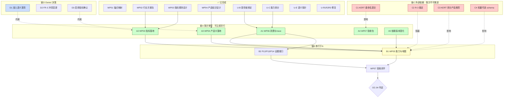

# GK-KE 全局任务规划与依赖执行图 V1.0

> 出具：GK-KE **全局 Tech Lead**（Owner 授权跨仓协作）｜日期：2026-09-12
> 依据：建议书 V2.0 §15.1–§15.5（C01–C08 与 WP01–WP07）｜`GK-KE-OWNER-004`
> 用途：**Owner Review 用**。本文**不派发任何任务**，仅呈现规划与依赖关系。
> 锚点：GK-KE `62b8f31`｜KERT `3b6640b`（工作区未提交整仓重命名，见 U-D）

---

## 0. 一句话总览

> 已完成 **WP01–WP04 + U-B/U-C/U-E/R-1/R-2/R-3**；
> 剩余工作分为 **5 条并行链**，其中**仅 1 条完全在我方掌控**，其余 4 条**各有外部依赖**。
> **关键结论：OC-04 的关闭取决于 KERT 侧 4 项治理，而非我方继续加班。**

---

## 1. 当前完成度盘点（截至 `62b8f31`）

| WP | 内容 | 状态 | 交付物 |
|---|---|---|---|
| WP01 | 三仓锚点与 ID 映射 | ✅ 完成 | `GK-KE-WP01-…-V1.0.md` |
| WP02 | 行业方案包 | ✅ 完成 | `SIM-IND-MANUFACTURING.json` |
| WP03 | 指标与规则 | ✅ 设计完成，**未落地** | `GK-KE-WP03-…-V1.0.md` |
| WP04 | 产品知识 | ✅ 设计完成，**未落地** | `GK-KE-WP04-…-V1.0.md` |
| WP05 | 能力与地图 | ⏸ **未开工**（依赖 WP06 与 KERT 侧） | — |
| WP06 | 业务证据与预览 | ⏸ 未开工 | — |
| WP07 | 验收包 | ⏸ 未开工 | — |
| — | U-B 提供者绑定 | ✅ 完成 | `provider-bindings.json` |
| — | U-C 能力拆分 | ✅ 完成 | `PRODUCT-DOCTOR/CONDITION.json` |
| — | U-E 语义探针 | ✅ 完成（10/12 PASSED） | `gk_ke_capability_probe.py` |
| — | R-1/R-2/R-3 | ✅ 完成 | `Capability.json` / `CapabilityIdMapping.json` |

**`callable` 真实值：1 → 10**（剩余 2 项均有正当阻塞原因）

---

## 2. 剩余工作全清单（**不只 WP06**）

我识别出 **9 项剩余工作**，分属 5 条链：

### 链 A：我方完全掌控（**可立即并行**）

| 编号 | 工作 | 依据 | 产出 |
|---|---|---|---|
| **A1** | **WP06 能力间消费与 trace** | §14.2「能力之间真正消费结果」 | 结果合同 + 消费证据 + trace |
| **A2** | **WP03 落地**：15 项 MetricDefinition 受控定义 | §15.4 WP03 | `specs/gk-ke/v1/definitions/SIM.METRIC.*.json` |
| **A3** | **WP04 落地**：ProductCard 13 字段实体内容 | §15.4 WP04 | `SIM-ASSET-P001` 条件矩阵实体 |
| **A4** | **WP07 验收包**：60 案例执行与结果归档 | §14.4 | 逐例结果 + TP/FP/FN + 限制说明 |
| **A5** | **地图依赖版本清单固化** | §14.2 首项要求 | MapSpec 依赖锁定 |

### 链 B：依赖 A（**串行于 A**）

| 编号 | 工作 | 依赖 |
|---|---|---|
| **B1** | **WP05 能力与地图**：真实提供者绑定 + 计划编译 + 语义探针 | A1/A2/A3/A5 固定版本（§15.4 硬门禁） |
| **B2** | **三阶段交互（P12/P13/P14）** L4-1 证据接口 | A1（消费链） |

### 链 C：完全外部依赖（**我方不能推进**）

| 编号 | 工作 | 责任方 | 阻塞什么 |
|---|---|---|---|
| **C1（U-D）** | KERT 整仓重命名提交或存档 | **KERT 维护方** | 证据可复现性 |
| **C2（U-A）** | R-3 裁定（注释 vs 实现） | **KERT 维护方** | **`REPORT-ASSEMBLE` 的 callable** |
| **C3** | KERT 侧拆分产品推荐 | **KERT 维护方** | 体检门禁只能编排侧强制 |
| **C4** | `SKILL.md` 声明机器可读 schema | **KERT 维护方** | 结构层证据不足 |

### 链 D：Owner 决策（**不是我的权限**）

| 编号 | 工作 | 为什么必须 Owner |
|---|---|---|
| **D1（U-3）** | 「不产生准入结论」是否含条件判断 | §8.2 明文要求**先澄清语义**，**不得改名规避**；涉及权力边界 |
| **D2** | `SIM-RULE-FR-3`（"三层 14 项"）与 §6 冲突的变更批准 | 修改既有受控合同 |
| **D3** | 首批"实际启用指标"清单确认 | §14.2 要求以**数据可得性合同**为准 |

### 链 E：第二阶段（**依赖链 A/B 完成后**）

| 编号 | 工作 | 依据 |
|---|---|---|
| **E1** | 行业扩展（贸易、服务业方案包） | §15.1 第二批 |
| **E2** | GraphRAG A/B/C 对照 | §11.3 / §14.5（**须先有收益证据**） |
| **E3** | Kuzu → GraphQueryPort 迁移 | §11.4（**明确不得作为 OC-04 前置**） |
| **E4** | 业务效果验收（效率/质量实测） | §14.1 验收层 C |

---

## 3. 依赖执行图

### 3.1 主图（Mermaid）



### 3.2 拓扑分层（并行度视图）

```
层 0（当前）      ┌─ A1 ─┐ ┌─ A2 ─┐ ┌─ A3 ─┐ ┌─ A5 ─┐    ← 5 路并行
                  └──────┘ └──────┘ └──────┘ └──────┘
                                   │
层 1（A 完成后）  ┌──────────── B1（硬门禁：须消费 A1/A2/A3/A5 固定版本）────────────┐
                  │                              │
                  │                          B2（可与 B1 并行）
层 2（B 完成后）  └──────────────── A4 ──────────┘
                                   │
层 3              ┌──────── OC-04 判定 ────────┐
                  │必须是"约定地图 + 能力真实运行证据"│
                  └─────────────────────────────┘

贯穿全程（不计入关键路径）：
  链C（KERT 治理）—— 影响 B1 的 callable 完整性
  链D（Owner 决策）—— 影响 A2/A3 的内容正确性
```

### 3.3 关键路径（**这才是重点**）

```
关键路径 = A5 → B1 → A4 → OC-04 判定

但真正的约束不在路径长度，而在：
  B1 的完成质量取决于 C2（R-3 裁定）
  若 C2 不解决 → REPORT-ASSEMBLE 永远 callable=false
  → B1 永远无法声称"所需能力真实可调用"
  → OC-04 永远不达标
```

> **结论：OC-04 的瓶颈是 C2（R-3），不是我方的工作量。**

---

## 4. 并行/串行编排方案（拟派发计划）

### 4.1 第 1 波（可立即并行启动，5 个独立 SubAgent）

| 波次 | SubAgent | 任务 | 依赖 | 冲突风险 |
|---|---|---|---|---|
| **W1-a** | `evidence-chain` | A1 WP06 消费与 trace | 无 | 低（新增文件） |
| **W1-b** | `metric-owner` | A2 15 项 MetricDefinition 落地 | WP03 设计 | 低（新增定义） |
| **W1-c** | `product-owner` | A3 ProductCard 实体内容 | **D1 澄清** | **中（受 U-3 约束）** |
| **W1-d** | `verifier` | A4 验收脚本骨架（60 案例执行器） | 数据集 v2 | 低 |
| **W1-e** | `map-owner` | A5 依赖版本清单固化 | 无 | **中（改 MapSpec）** |

**并发安全分析**：
- W1-a/b/d **互不冲突**（不同目录）
- W1-c **受 D1 约束** —— 若 U-3 未澄清，**只能做不涉及准入语义的部分**（13 字段中 12 个）
- W1-e **改 `map_spec.json`** —— 与 W1-b（新增 definitions）不冲突，但**须先冻结 baseline**

### 4.2 第 2 波（W1 全部完成后，串行）

| 波次 | SubAgent | 任务 | 硬门禁 |
|---|---|---|---|
| **W2-a** | `capability-engineer` | B1 WP05 能力与地图 | **§15.4：须消费 W1 固定版本** |
| **W2-b** | `integration-engineer` | B2 P12/P13/P14 证据接口 | 依赖 W1-a |

**W2-a 的硬门禁是关键**：建议书 §15.4 明确「WP05 必须消费 WP02–WP04 的**固定版本**；
**只有前序输入达到合同要求，才进入整体运行验收**」。

### 4.3 第 3 波（W2 完成后）

| 波次 | SubAgent | 任务 |
|---|---|---|
| **W3-a** | `independent-qa` | A4 正式验收（**不得由我代签**） |
| **W3-b** | `reporter` | OC-04 判定包（定义/运行/业务三层分开） |

### 4.4 贯穿全程（不占波次）

| 项 | 动作 | 我的职责 |
|---|---|---|
| 链 C | 整理**给 KERT 维护方的正式确认函** | 我出函，Owner 决定是否发 |
| 链 D | 整理**Owner 决策请求单**（D1/D2/D3） | 我出单，你裁定 |

---

## 5. 冲突与风险矩阵

| # | 风险 | 影响 | 缓解 |
|---|---|---|---|
| **RK-1** | **多个 SubAgent 同改 `specs/`** | 基线漂移 | **每次改动前冻结 HEAD，改后立即 `make check` + 提交** |
| **RK-2** | SubAgent 写"看起来对"但不可验证的内容 | 假绿复发 | **强制：每项产出附可复算证据；我逐项审** |
| **RK-3** | SubAgent 越权改 `generated/` 或 `_registry.json` | 破坏保护 | **派工时明确禁止；审阅时 `git diff` 核查** |
| **RK-4** | SubAgent 声称"完成"但实为空转 | 历史问题 | **沿用变异测试思路：对关键断言做破坏性验证** |
| **RK-5** | W1-c 在 D1 未澄清时越权 | 权力边界 | **W1-c 限定范围：不做条件判断语义** |
| **RK-6** | KERT 侧未提交改动被误当基线 | 证据失效 | **只读核查，不改 KERT；锚点标"工作区状态"** |

### 5.1 我审阅 SubAgent 结果的标准（**写下来便于你监督**）

| 维度 | 审什么 |
|---|---|
| **真实性** | 引用的行号/文件/字段**是否真实存在**（我会亲自 grep 抽验） |
| **完整性** | 是否覆盖了任务要求的**全部**必填项 |
| **诚实性** | 未做的部分**是否如实标注**（而非留空或含糊） |
| **非空转** | 关键断言**是否有触发反例**（不是"写了就等于有效"） |
| **边界** | 是否**越界修改**了禁改文件 |
| **可复算** | 数值结论**能否被独立重算** |

> **抽查机制**：我不逐字复读 SubAgent 输出，而是**随机抽取 3 处断言，亲自核实源头**。

---

## 6. 需要你 Review 的 5 个决策点

| # | 决策点 | 我的建议 | 备选 |
|---|---|---|---|
| **Q1** | 第 1 波是否**5 路并行** | 建议：**先跑 A1/A2/A4/A5 四路**，W1-c 等 D1 | 也可 5 路全开（W1-c 限范围） |
| **Q2** | **D1（准入语义）** 是否现在澄清 | 建议：**现在澄清** —— 否则 A3 只能做 12/13 字段，返工风险高 | 先做 12 字段，后续补 |
| **Q3** | **D2（FR-3 冲突）** 是否批准变更 | 建议：**批准** —— 否则 WP03 落地会带着已知冲突 | 保留冲突并记录 |
| **Q4** | **D3（启用指标）** 由谁定 | 建议：**我出候选清单（附可得性合同状态），你确认** | 由指标 Owner 定 |
| **Q5** | 是否**现在出函给 KERT 维护方**（C1–C4） | 建议：**立即出函** —— 这是 OC-04 的真正瓶颈 | 等我方做完 A/B 再出 |

---

## 7. 我作为全局 TL 的自我约束（声明）

| # | 约束 |
|---|---|
| 1 | 我**不自己写实现**（除编排、合同、审阅）—— 实现派 SubAgent |
| 2 | 我**不代签** QA 结论（W3-a 必须独立角色） |
| 3 | 我**不绕过** P20/DKES/PI-0 等保护；**不手改** `generated/` |
| 4 | 我**不用"完成了 N 个文件"当成果** —— 元数据不是业务完成度 |
| 5 | 我**不在 D1/D2/D3 未决时**替 Owner 裁定 |
| 6 | 我**不修改 KERT 仓**（只读核查），跨仓结论附源码证据 |
| 7 | 每次交付**如实列出**：定义状态 / 实现状态 / 运行证据 / 剩余缺口 |

---

## 8. 下一步（等你 Review 后）

**你确认 Q1–Q5 后**，我立即：

1. 派发**第 1 波 SubAgent**（按 Q1 的并行度）
2. 逐项**审阅**其产出（按 §5.1 标准 + 抽查 3 处）
3. 出**给 KERT 维护方的确认函**（若 Q5 批准）
4. 出 **Owner 决策请求单**（D1–D3）

**在 D1/D2/D3 未决前**，我不动涉及这三点内容正确性的部分。
