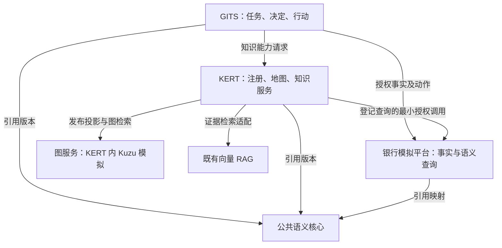

# GITS—KERT 知识工程系统群项目总契约 V1.0

项目编号：GK-KE-20260910。编制角色：知识工程系统架构师 / 契约设计负责人。需求提出人：邵钟飞。日期：2026-09-10。

**结论：建设五个逻辑子系统、六个责任边界；以知识注册中心和经过审核的任务知识地图作为发现与激活入口，以分析语义服务保证数值口径，以证据与受控动作形成业务闭环。** 五个逻辑子系统为公共语义核心、银行数据与业务模拟平台、KERT、GITS、图服务。分析语义服务是银行数据平台内的独立责任模块，不新增一份客户事实库。图服务首期部署在 KERT 内部，以 Kuzu 模拟，保持可替换接口。

## 1. 本轮合同的效力

| 项目 | 声明 |
|---|---|
| 授权依据 | 本轮用户明确要求：重新设计系统群，以项目契约/合同输出，并覆盖地图自动构建、审核发布、既有向量 RAG 与模拟数据 |
| 文档状态 | DESIGN_CANDIDATE / CONTRACT_CANDIDATE，交付内容完整，可供开发计划与评审使用 |
| 实现状态 | 仅随包合同样例、造数样例和离线校验已运行；系统服务与图框架集成未实施 |
| 审批状态 | 本包作者自检；独立 QA、业务 Owner 审签、生产验收均未执行 |
| 与既有合同关系 | 新命名空间 gk-ke/v1 的增量候选；禁止覆盖现有 P20、DKES、PI-0 合同或生成目录 |
| 模拟环境 | simulationOnly=true；所有客户、机构、政策、产业报告及审批均为虚构；不得用于真实银行判断 |

本合同中的“必须/不得”为目标实现的强制要求；“建议”为可经 ADR 调整的实现选择。“审核通过”只表示特定内容、用途、范围和版本获授权采用，不表示其对现实世界具有无条件真理性。知识正确性、工程一致性和使用授权分别验证。

## 2. 输入与优先级

1. 本轮用户明确的五方责任、Kuzu 内部模拟、既有传统向量 RAG、LLM 造数要求。
2. 本会话前一版 27 页设计与“推荐开源Graph RAG”后续的独立公共语义核心前提。
3. 已读取的《GITS-KNO-P20_knowledge-engineering-architecture_V1.0_20260818.md》与《02_需求与契约变更包_V1.0.md》：保留四类资产、确定性路由与计划、证据链、不可变 Release、用途门禁；历史实现状态不继承为本轮结果。
4. 官方理论与组件资料仅支持技术判断，不能覆盖银行业务口径。来源见 references/技术依据与决策.md。

历史文档中将客户等操作对象集中于单一操作核心，以及固定技术栈全部必选的描述，与本轮边界存在差异，按 CR-01 至 CR-08 显式迁移。现有源码、完整现行 Schema 与正式批准记录未在本轮核查，不声称与现有字段完全兼容。

## 3. 业务交付目标

围绕对公客户经理持续经营，交付以下可验证结果：

| 需求 ID | 用户需求 | 必须交付 | 合同 | 主要验收 |
|---|---|---|---|---|
| REQ-01 | 谁定义、谁保管、谁执行 | 对象级权威矩阵、公共/领域语义包 | C01 | T01–T04 |
| REQ-02 | 指标含义与数字一致 | 映射、指标合同、受控查询与复算 | C04 | T11–T16 |
| REQ-03 | 模型发现分散知识 | 注册中心、任务知识地图、渐进披露 | C02 | T05–T07、T17 |
| REQ-04 | 从非结构化文档自动建图 | 候选断言/候选地图、差异审核、不可变发布 | C03 | T08–T10、T18–T21 |
| REQ-05 | 在既有 RAG 上引入图能力 | RAG 适配、LightRAG 受控试验、Kuzu 投影 | C05 | T22–T25 |
| REQ-06 | 知识能支持经营动作 | GITS 任务、KERT 子计划、证据响应、确认与回执 | C06 | T26–T29 |
| REQ-07 | 全部数据可模拟 | LLM 场景种子、结构化派生、非结构化材料、真值与负例 | C07 | T30–T33 |
| REQ-08 | 可按合同开发与验收 | Schema、正负例、接口、变更清单、Loop、证据包 | C08 | T34–T36 |

上述测试编号均在 acceptance/验收矩阵.csv 中定义；其中服务级测试为待实施计划，不能被本包离线校验替代。

## 4. 总体关系

连线表示调用/引用，不表示所有权转移。KERT 可凭收窄的任务授权调用分析语义服务；所有客户事实仍由模拟银行源负责。KERT 内的知识子计划不能自行扩大 GITS 任务范围。

## 5. 理论成立的必要条件

- 概念模型、具体断言、检索表示、业务决定分层；“出现在图中”不能自动推出“真实、有效、适用于当前客户”。
- 逻辑上的唯一权威允许缓存和投影副本；每个字段和状态都必须能定位唯一变更责任与源版本。
- 文档存在某句表述是可核对的文档事实；该句关于企业的判断仍可能是作者观点、预测或过期结论。
- 文档世界采用开放信息假设：没提到不等于不存在；业务规则仅在明确的输入完整性范围内执行三值判断。
- 本体约束不自动等于可执行规则，也不能保证大模型输出正确；结构校验、业务验证、授权执行各有执行器。
- 知识地图是面向任务的资产/能力导航模型；实体关系图是内容表示。GraphRAG 可帮助发现关联，不能自动产生可靠的 Skill 调用合同。
- 同一受控输入和版本生成同一规范化激活计划；自然语言意图识别可能不确定，须先固化为明确 TaskContext。
- 规则失效、证据撤销和权限变化可以使旧计划不可执行；历史可重放不意味着旧权限仍可使用。

## 6. 交付包阅读顺序

| 路径 | 用途 |
|---|---|
| contracts/C01_系统边界与理论合同.md | 权威矩阵、类型/实例/规则与推理边界 |
| contracts/C02_注册中心与知识地图合同.md | 地图元模型、注册服务、发现到激活 |
| contracts/C03_自动构建审核发布合同.md | 文档候选→审核→发布→撤销完整链 |
| contracts/C04_分析语义服务合同.md | 指标、粒度、时态、权限和复算 |
| contracts/C05_RAG与图适配合同.md | 既有 RAG、LightRAG、Kuzu 的选择和边界 |
| contracts/C06_运行与接口合同.md | API、事件、证据、任务及动作控制 |
| contracts/C07_模拟数据合同.md | 数据字典、LLM 造数、样例规模和隔离 |
| contracts/C08_实施验收与变更合同.md | Loop 工作单、迁移、QA、Owner 审签 |
| schemas/、examples/ | 最小交换对象与可检验正负例；不冒充现有生产 Schema |
| simulation/ | 可直接用于验证开发的小型完整模拟数据集 |
| acceptance/ | 完整验收计划与本包实际自检结果，分开存放 |
| tools/ | 标准库造数编译器、JSON Schema/跨对象离线校验器 |

交付采用可版本管理的 Markdown、JSON Schema、JSON/CSV、Python 校验工具和 ZIP，形成可审阅的开发输入。

## 7. 建议实施取舍

先建设注册中心、审核发布、受控语义查询和一条经营闭环；同时完成小范围 LightRAG 候选抽取试验。图检索上线以固定题集的增益与维护成本为依据。保留 Python Core 与既有应用栈，Java Skill Runtime 沿既有适配方向验证。首期不要求 OWL 推理、SPARQL、OpenSPG 或新的企业图平台；已有相应实现也不得擅自删除，须走迁移合同。

造数采用“大模型编写场景事实种子与材料，确定性程序派生账务和统计，独立校验器复算”。逐条让模型随意生成余额会破坏账务一致性，因此模型控制业务内容，数值恒等式由程序落实。样例的生成人是本次助手，未伪造外部模型 API 调用记录。
