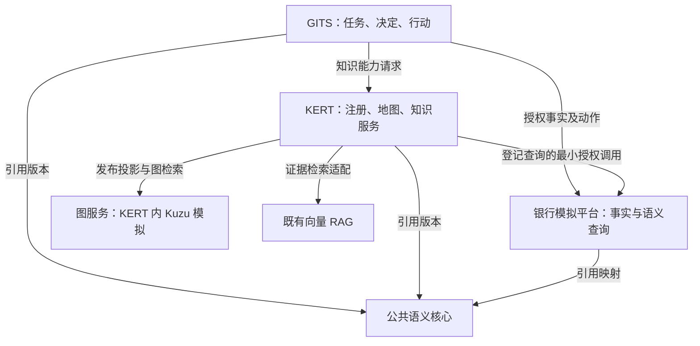

# GITS—KERT 知识工程系统群项目总契约 V1.0

项目编号：GK-KE-20260910。编制角色：知识工程系统架构师 / 契约设计负责人。需求提出人：邵钟飞。日期：2026-09-10。

**结论：建设五个逻辑子系统、六个责任边界；以知识注册中心和经过审核的任务知识地图作为发现与激活入口，以分析语义服务保证数值口径，以证据与受控动作形成业务闭环。** 五个逻辑子系统为公共语义核心、银行数据与业务模拟平台、KERT、GITS、图服务。分析语义服务是银行数据平台内的独立责任模块，不新增一份客户事实库。图服务首期部署在 KERT 内部，以 Kuzu 模拟，保持可替换接口。

## 1. 本轮合同的效力

| 项目 | 声明 |
|---|---|
| 授权依据 | 本轮用户明确要求：重新设计系统群，以项目契约/合同输出，并覆盖地图自动构建、审核发布、既有向量 RAG 与模拟数据 |
| 文档状态 | DESIGN_CANDIDATE / CONTRACT_CANDIDATE，交付内容完整，可供开发计划与评审使用 |
| 实现状态 | 仅随包合同样例、造数样例和离线校验已运行；系统服务与图框架集成未实施 |
| 审批状态 | 本包作者自检；独立 QA、业务 Owner 审签、生产验收均未执行 |
| 与既有合同关系 | 新命名空间 gk-ke/v1 的增量候选；禁止覆盖现有 P20、DKES、PI-0 合同或生成目录 |
| 模拟环境 | simulationOnly=true；所有客户、机构、政策、产业报告及审批均为虚构；不得用于真实银行判断 |

本合同中的“必须/不得”为目标实现的强制要求；“建议”为可经 ADR 调整的实现选择。“审核通过”只表示特定内容、用途、范围和版本获授权采用，不表示其对现实世界具有无条件真理性。知识正确性、工程一致性和使用授权分别验证。

## 2. 输入与优先级

1. 本轮用户明确的五方责任、Kuzu 内部模拟、既有传统向量 RAG、LLM 造数要求。
2. 本会话前一版 27 页设计与“推荐开源Graph RAG”后续的独立公共语义核心前提。
3. 已读取的《GITS-KNO-P20_knowledge-engineering-architecture_V1.0_20260818.md》与《02_需求与契约变更包_V1.0.md》：保留四类资产、确定性路由与计划、证据链、不可变 Release、用途门禁；历史实现状态不继承为本轮结果。
4. 官方理论与组件资料仅支持技术判断，不能覆盖银行业务口径。来源见 references/技术依据与决策.md。

历史文档中将客户等操作对象集中于单一操作核心，以及固定技术栈全部必选的描述，与本轮边界存在差异，按 CR-01 至 CR-08 显式迁移。现有源码、完整现行 Schema 与正式批准记录未在本轮核查，不声称与现有字段完全兼容。

## 3. 业务交付目标

围绕对公客户经理持续经营，交付以下可验证结果：

| 需求 ID | 用户需求 | 必须交付 | 合同 | 主要验收 |
|---|---|---|---|---|
| REQ-01 | 谁定义、谁保管、谁执行 | 对象级权威矩阵、公共/领域语义包 | C01 | T01–T04 |
| REQ-02 | 指标含义与数字一致 | 映射、指标合同、受控查询与复算 | C04 | T11–T16 |
| REQ-03 | 模型发现分散知识 | 注册中心、任务知识地图、渐进披露 | C02 | T05–T07、T17 |
| REQ-04 | 从非结构化文档自动建图 | 候选断言/候选地图、差异审核、不可变发布 | C03 | T08–T10、T18–T21 |
| REQ-05 | 在既有 RAG 上引入图能力 | RAG 适配、LightRAG 受控试验、Kuzu 投影 | C05 | T22–T25 |
| REQ-06 | 知识能支持经营动作 | GITS 任务、KERT 子计划、证据响应、确认与回执 | C06 | T26–T29 |
| REQ-07 | 全部数据可模拟 | LLM 场景种子、结构化派生、非结构化材料、真值与负例 | C07 | T30–T33 |
| REQ-08 | 可按合同开发与验收 | Schema、正负例、接口、变更清单、Loop、证据包 | C08 | T34–T36 |

上述测试编号均在 acceptance/验收矩阵.csv 中定义；其中服务级测试为待实施计划，不能被本包离线校验替代。

## 4. 总体关系

连线表示调用/引用，不表示所有权转移。KERT 可凭收窄的任务授权调用分析语义服务；所有客户事实仍由模拟银行源负责。KERT 内的知识子计划不能自行扩大 GITS 任务范围。

## 5. 理论成立的必要条件

- 概念模型、具体断言、检索表示、业务决定分层；“出现在图中”不能自动推出“真实、有效、适用于当前客户”。
- 逻辑上的唯一权威允许缓存和投影副本；每个字段和状态都必须能定位唯一变更责任与源版本。
- 文档存在某句表述是可核对的文档事实；该句关于企业的判断仍可能是作者观点、预测或过期结论。
- 文档世界采用开放信息假设：没提到不等于不存在；业务规则仅在明确的输入完整性范围内执行三值判断。
- 本体约束不自动等于可执行规则，也不能保证大模型输出正确；结构校验、业务验证、授权执行各有执行器。
- 知识地图是面向任务的资产/能力导航模型；实体关系图是内容表示。GraphRAG 可帮助发现关联，不能自动产生可靠的 Skill 调用合同。
- 同一受控输入和版本生成同一规范化激活计划；自然语言意图识别可能不确定，须先固化为明确 TaskContext。
- 规则失效、证据撤销和权限变化可以使旧计划不可执行；历史可重放不意味着旧权限仍可使用。

## 6. 交付包阅读顺序

| 路径 | 用途 |
|---|---|
| contracts/C01_系统边界与理论合同.md | 权威矩阵、类型/实例/规则与推理边界 |
| contracts/C02_注册中心与知识地图合同.md | 地图元模型、注册服务、发现到激活 |
| contracts/C03_自动构建审核发布合同.md | 文档候选→审核→发布→撤销完整链 |
| contracts/C04_分析语义服务合同.md | 指标、粒度、时态、权限和复算 |
| contracts/C05_RAG与图适配合同.md | 既有 RAG、LightRAG、Kuzu 的选择和边界 |
| contracts/C06_运行与接口合同.md | API、事件、证据、任务及动作控制 |
| contracts/C07_模拟数据合同.md | 数据字典、LLM 造数、样例规模和隔离 |
| contracts/C08_实施验收与变更合同.md | Loop 工作单、迁移、QA、Owner 审签 |
| schemas/、examples/ | 最小交换对象与可检验正负例；不冒充现有生产 Schema |
| simulation/ | 可直接用于验证开发的小型完整模拟数据集 |
| acceptance/ | 完整验收计划与本包实际自检结果，分开存放 |
| tools/ | 标准库造数编译器、JSON Schema/跨对象离线校验器 |

交付采用可版本管理的 Markdown、JSON Schema、JSON/CSV、Python 校验工具和 ZIP，形成可审阅的开发输入。

## 7. 建议实施取舍

先建设注册中心、审核发布、受控语义查询和一条经营闭环；同时完成小范围 LightRAG 候选抽取试验。图检索上线以固定题集的增益与维护成本为依据。保留 Python Core 与既有应用栈，Java Skill Runtime 沿既有适配方向验证。首期不要求 OWL 推理、SPARQL、OpenSPG 或新的企业图平台；已有相应实现也不得擅自删除，须走迁移合同。

造数采用“大模型编写场景事实种子与材料，确定性程序派生账务和统计，独立校验器复算”。逐条让模型随意生成余额会破坏账务一致性，因此模型控制业务内容，数值恒等式由程序落实。样例的生成人是本次助手，未伪造外部模型 API 调用记录。

---

# C01 系统边界、语义权威与理论约束合同

版本 1.0.0；状态 CONTRACT_CANDIDATE；需求 REQ-01。提供方：公共语义核心及各领域 Owner；消费者：全部子系统。变更进入 CR-01/02，不能凭本文件直接替换旧基线。

## 1. 五个子系统与六个责任边界

| 逻辑系统/模块 | 谁定义 | 谁保管 | 谁执行 | 不得承担 |
|---|---|---|---|---|
| 公共语义核心 | 企业语义 Owner | 版本化类型、标识规则、基础关系与映射规范；可用受控仓库发布 | 包解析、结构/兼容性检查 | 全行客户事实、产品政策或业务审批 |
| 银行数据与业务模拟平台 | 模拟源数据 Owner；正式接入后对应源系统 Owner | 客户、账户、产品主档、交易、额度、正式决定的模拟源记录 | 对象查询、数据产品、模拟动作与源回执 | 自行认定产品条款或经营建议 |
| 分析语义服务（数据平台内模块） | 指标 Owner 定义指标；数据 Owner 定义映射 | MetricDefinition、Mapping、查询模板和运行追踪；不另存客户权威事实 | 校验、编译、绑定参数、查询、复算与解释 | 任意 LLM SQL、LLM 算金额、业务审批 |
| KERT | 知识 Owner 定义解释/规则；平台维护资产模式 | 原文版本引用或获准保管的原文、断言、规则、地图、注册记录、审核与发布 | 知识加工、检索、规则和知识 Skill；签名发布校验 | 客户主数据、GITS 推荐状态或正式业务决定 |
| GITS | 业务流程 Owner | 经营任务、互动、声明、候选建议、人工决定、行动意图及回执引用 | 任务组织、业务计划、确认、动作委托、对账恢复 | 改写 KERT 规则或源系统事实 |
| 图服务（KERT 内 Kuzu 模拟） | 模式由核心/领域定义；投影规则由图适配 Owner 定义 | 候选图及已发布图的不同投影；均可重建 | 已注册 queryId 的有界关系查询 | 知识审核、权限放大、批准业务、独立创造事实 |

独立逻辑边界不要求独立微服务。首期可以公共包目录 + 银行模拟 API + KERT 模块化服务 + GITS 现有应用；Kuzu 由 KERT 图适配 Worker 独占写入。

## 2. 对象级唯一权威

| 对象或字段 | 定义权 | 值/状态权威 | KERT/GITS 允许保存 |
|---|---|---|---|
| Customer 类型、customerId 规则 | 公共核心 | 客户主档由银行源权威 | ID、授权快照、snapshotRef、asOf；不得自主并户 |
| Product 类型与 productId | 公共核心 | 产品代码/产品主档由银行源权威 | KERT 持产品知识；GITS 持候选产品引用 |
| ProductTerm、准入条件解释 | KERT 领域 Owner | 获授权的知识认定与发布记录 | 发布版本引用与证据 |
| Account、Transaction、CreditFacility | 公共类型 + 源扩展 | 银行源记录 | 数据产品结果与来源，缓存不改权威 |
| MetricDefinition | 指标 Owner，沿用公共类型 | 分析语义服务受控定义包 | KERT 注册元数据引用；GITS 引用结果 |
| Task、Interaction、Recommendation | GITS 领域 Owner | GITS | KERT 持最小必要执行上下文，按保留策略清理 |
| SourceVersion、Assertion、MapRelease | KERT | KERT 认定/发布流程 | GITS 只引用已授权版本 |
| HumanConfirmation | 对应决定领域 | 知识审核在 KERT；业务确认在 GITS；正式审批在银行源 | 必须区分 decisionKind 与 ownerSystem |
| ActionReceipt | 源系统定义执行结果；GITS 定义编排状态 | 银行源的业务回执；GITS 的接收/对账记录 | 两类 ID 关联，不能同名互覆盖 |
| 图边、向量、Wiki 展示 | 投影合同 | 上述源对象或经认定断言 | projectionVersion、sourceRefs、可重建副本 |

唯一权威是按属性、有效期和责任域划分，不是“一切只能有一条记录”。不同来源可以提出互相矛盾的断言；原断言各自保留，适用结论由有权领域认定。政策规范与实际事实不能放进一条全序权威排名：政策规定限额与系统记录实际余额属于不同谓词。

## 3. 公共语义包

最小共享类型：Customer、LegalEntity、Organization、Account、Product、Transaction、Money、TimeInterval、ExternalIdentifier。领域包使用 imports 引用 corePackageId/version/hash；共享类型不得复制后改义。相同名称、不同登记主体不能自动 sameAs；合并必须经身份解析规则与人工例外处理。

每个类型含 typeId、中文定义、主键语义、属性类型、必填性、关系目标、关系基数、时态与敏感标记。类型校验与业务完整性分开：字段可空不代表规则可默认通过。

Money 使用十进制字符串或整数分，强制 currency 与 unit；汇率含 base/quote、rate、rateDate、sourceRef。账户余额是存量，交易金额是流量，意向金额是声明，额度和可提款金额分别建模。时间间隔统一左闭右开 [from,to)，业务日期采用 Asia/Shanghai；记录时间采用带时区 UTC 时间戳。

Map/Assertion 等治理合同字段不全部上升为银行业务本体类。PROV 的实体、活动、责任主体可作为血缘概念参照，不要求首期 RDF 存储。

## 4. 可验证不变量

| ID | 约束 | 实现证据 |
|---|---|---|
| INV-01 | 每个可变权威字段有唯一 ownerSystem；所有投影写入口受限 | 权威矩阵 + 负向写入测试 |
| INV-02 | 每条可用于回答的断言有来源、有效范围和认定状态 | 引用闭包校验 |
| INV-03 | 模型、相似度、图连通性均不能授予批准/权限 | 权限拒绝及候选隔离测试 |
| INV-04 | 共享类型的 imports 可解析且版本兼容 | 破坏性变更对比 |
| INV-05 | 客户声明不能自动转成银行事实 | 3000 万案例 |
| INV-06 | 查询结果可定位输入快照、指标版本和计算过程 | 日均复算 |
| INV-07 | 被撤销资产和未经授权路径不能进入新上下文 | 版本/ACL 负测 |
| INV-08 | 正式动作必须绑定有效确认并由执行方重复检查 | 版本失配/重放测试 |

这些是可验证的系统性质，不是“已经数学证明 AI 永不出错”。Schema 验证结构，业务测试验证有限场景，实测评估估计检索质量；没有任何一项单独证明现实知识完整或正确。

## 5. 推理规则

- 关系命名必须区分 suppliesTo、mentions、suggestsNeed、eligibleFor；mentions 不推导持有关系，suppliesTo 不自动推导融资需求。
- 只允许有 ID、版本和适用域的推导规则；每个推导结论保留 derivationRuleRef 与 premiseRefs。
- 默认不启用任意递归规则；允许的递归遍历须设最大深度、节点数、超时并去环。
- 必需条件为 TRUE/FALSE/UNKNOWN。AND：任一 FALSE 即 FALSE；无 FALSE 且存在 UNKNOWN 则 UNKNOWN；其余 TRUE。缺失、过期、冲突都不得变成 TRUE。
- 发布可包含“存在待研究问题”的导航；具体用于准入推荐的必需规则不能以未认定或冲突状态发布。

## 6. 前后条件与失败

导入语义包前：身份校验、包哈希、依赖版本、Owner 决议齐备；导入后：只产生新版本，不改旧实例历史含义。缺失依赖返回 CORE_VERSION_UNRESOLVED；破坏性变化返回 CONTRACT_MIGRATION_REQUIRED；权威不明返回 AUTHORITY_UNRESOLVED。迁移须双版本读取、显式映射与退役计划。

---

# C02 知识注册中心与任务知识地图合同

版本 1.0.0；状态 CONTRACT_CANDIDATE；需求 REQ-03。Provider=KERT；Consumer=GITS、KERT Planner、知识维护人员。公共语义包、指标服务和业务工具只在这里登记引用，原定义权不转移。

## 1. 地图是什么

采用三种相关但不同的视图：

| 视图 | 节点与关系 | 作用 | 权威 |
|---|---|---|---|
| 内容知识图 | 实体、概念、文档断言及内容关系 | 跨文档发现、关系检索 | 断言账本/来源；候选图非权威 |
| 任务知识地图 | 任务、知识域、资产、指标、规则、Skill 和用途关系 | 告诉模型应找什么、为何找、如何调用 | 审核后的地图规范及发布包 |
| 运行依赖图 | 某任务实际选择的资产版本、工具和步骤 | 执行、证据追踪、变更影响 | 本次 ActivationPlan 与 RunManifest |

地图可以有环，如 relatedTo；可执行依赖子图必须是 DAG，或引用显式有界迭代 Skill。禁止把内容图的任意路径直接变成工具执行序列。

## 2. 注册中心是控制目录，不复制所有知识

逻辑模块为 AssetCatalog、SourceRegistry、CapabilityRegistry、QueryRegistry、MapRegistry、ReleaseRegistry。共用 catalogRevision 与统一发现 API，按对象保留定义 Owner。建议复用 KERT 关系存储事务；模拟版可用 SQLite/文件版本包。Kuzu 不承载注册中心权威事务。

| 注册对象 | 必需字段 | 约束 |
|---|---|---|
| AssetVersion | assetId、version、assetClass、kind、title、description、ownerSystem、ownerRole、contentRef、contentHash、coreVersion、scope、purposeFlags、lifecycle、dependencyRefs | assetId 稳定；version 不可变；审批的是具体版本/哈希 |
| SourceVersion | sourceId、version、originalRef、hash、issuedAt、validFrom/to、sourceClass、allowedUses、permissionRef、simulationOnly | 文档替代产生新版本；检索块不能是唯一原文 |
| Capability | capabilityId、version、inputSchemaRef、outputSchemaRef、executorRef、preconditions、sideEffect、permissionRef、budget、timeoutMs、idempotencyPolicy | 文档建议某工具，不等于存在可调用工具；需要运行探针 |
| QueryDefinition | queryId、version、parameterSchemaRef、templateRef、resultSchemaRef、sourceProductRef、maxRows、timeoutMs、metricRef | LLM 只选择 queryId 与参数；模板由平台签署 |
| MapVersion | mapId、version、taskTypes、entryNodes、nodes、edges、routePolicyRef、releaseRef、coverage、dependencyRefs | 每个资产/能力引用可解析；没有入口和用途说明不能激活 |
| Release | releaseId、manifest、hash、approvalRefs、qualityRunRef、effectiveFrom、purposeFlags | 发布内容不可变；当前指针单独维护，更新使用版本条件 |

沿用 P20 四类 assetClass：FOUNDATIONAL_DATA、KNOWLEDGE_RULE、PROCESS_TOOL、RUNTIME_FEEDBACK。制度/产品/流程/案例/行业作为独立 subjectCategory，不替换四类枚举。PUBLIC、INTERNAL 等是来源/访问维度；不可把这些维度混成一个 taxonomy。附包 schema 为独立交换候选，现有枚举字段接入前做逐字段映射。

## 3. 地图节点与边的合同

节点分为 Task、KnowledgeDomain、Asset、Capability；EntityType/Metric/Rule 通过相应资产 kind 指定，避免反复定义公共类型。每个节点具 nodeId、中文说明、refId/refVersion（Task 可内嵌任务定义）、适用场景和必要性。

| 边类型 | 允许端点 | 含义 | 审核要求 |
|---|---|---|---|
| requires | Task → Asset/Capability | 任务必需的知识或能力 | 业务 Owner 确认必要性；必需项缺失则阻断相关任务 |
| optional | Task → Asset/Capability | 增强性背景 | 不可影响必需规则的判定 |
| uses | Capability → Asset | 能力实际消费的资产 | 依赖必须与能力合同一致 |
| dependsOn | Asset/Capability → Asset/Capability | 构建或执行依赖 | 执行子图不得成环 |
| covers | KnowledgeDomain → Asset | 知识域包含资产 | 知识 Owner 审核归类 |
| relatedTo | KnowledgeDomain/Asset → KnowledgeDomain/Asset | 导航关联 | 不产生执行权限或事实推导 |

每条边有 edgeId、reason、evidenceRefs（来源内容依据）或 designDecisionRef（专家配置依据）。`requires` 的依据可以是经审批的任务设计，不能伪装成文档原文。内容图边在 Assertion 合同保存 subject/predicate/object，不混用地图边枚举。

## 4. 模型如何使用地图

1. GITS 先把任务、角色、客户引用、机构范围、用途和期限形成 TaskContext；身份来自服务端认证。
2. 调用 discover，只返回当前用户可见的知识域与任务摘要，包括能回答什么、何时不适用、输入缺口、所需能力。
3. 模型选择候选任务/域；服务端用 RoutePolicy 确定匹配。无匹配或同优先级并列返回拒绝/澄清，不由模型随机决胜。
4. expand 返回选中子图的资产版本、输入输出、证据要求、权限和预算摘要；不把全行图塞入提示词。
5. plan 确定性解析依赖、固定版本、检查能力探针状态和授权，生成 ActivationPlan。不同路径汇入同一计划合同。
6. execute 只允许计划内能力；KERT 内部知识子步骤由 KERT 调度，GITS 保持经营任务与业务动作责任。
7. 返回 EvidenceBundle、已完成/缺失/冲突和后续补证需求，供 GITS 生成受控建议。

首期默认 discover ≤10 个入口，expand ≤50 节点，图遍历 ≤3 跳，模型证据预算 ≤12000 tokens；这些是合同配置初值，须记录实际模型上下文和测试后调整，不能冒充性能基准。超限返回分页或 BUDGET_EXCEEDED，不能静默丢失必需项。

## 5. 地图不是能力清单截图

示例：任务“为模拟精密部件企业准备访前融资讨论”。必需资产为客户事实查询、存款指标、已发布产品条款、准入规则与互动声明；行业报告为可选背景。能力为产品解读、客户体检、行业证据检索；每项都绑定输入/输出与证据。客户名称来自银行主档，行业关系来自文档断言，产品适用性来自规则，不能把三者压成一个相似度分数。

地图质量拆成：任务覆盖率、必需资产完备率、引用完整率、可执行能力探针成功率、歧义率、权限泄漏率。不能用节点数、边数或向量召回率代表地图质量。

## 6. 单写与多视图

作者维护受控 MapSpec 和 AssetVersion；Wiki、图投影、面向模型的 Markdown 说明由同一发布清单生成。专家修改 Wiki 时产生变更候选/结构化补丁，再走审核；禁止双向无审查同步。注册中心只是外部定义的权威引用：指标定义改动须由指标 Owner 发布，不能在地图 UI 内暗改。

注册状态与可用性分离：已发布资产可能暂时不可达；可达的候选资产仍不能正式使用。缓存键至少包含 tenant、principalScopeHash、purpose、releaseId、catalogRevision；ACL 变更时失效。哈希只能检验完整性，真实性还需源身份与签署责任。

## 7. 接口结果与失败

discover/expand 必须先做权限过滤，标题、节点数量、关系邻居也受保护。资产失效返回 ASSET_NOT_AVAILABLE；引用断裂返回 DEPENDENCY_UNRESOLVED；同优先级路由歧义返回 ROUTE_AMBIGUOUS；未注册能力返回 CAPABILITY_NOT_REGISTERED。选定必需项失败则计划失败，可选项失败可返回明确降级结果。

## 8. 验收

T05：同一任务从 Wiki 入口与对象入口在相同确定 TaskContext 下得到相同 canonical planHash。T06：引用一个不存在或未发布的 Skill，计划必须失败。T07：秘密资产不会出现在无权用户的目录、摘要、邻居或计数中。T17：同优先级路由冲突必定拒绝；模型不能靠重述问题绕过。服务级测试另行实施。

---

# C03 非结构化知识自动构建、审核与发布合同

版本 1.0.0；状态 CONTRACT_CANDIDATE；需求 REQ-04。KERT 为 Provider；知识 Owner 为认定责任方；GITS 仅消费获准用途的 Release。

## 1. 自动化边界

自动化可以完成文档结构识别、候选概念/断言抽取、去重候选、主题聚类、资产归类建议、地图连边建议、冲突检测与影响分析。**岗位任务目录、能力合同、适用性规则与批准责任不能仅从文档自动推导。** 地图生成须同时输入受控 TaskTemplate、AssetCatalog、CapabilityRegistry、公共/领域类型包，以及文档候选。

自动构建率、审核通过率和真实正确率是不同指标。用第二个大模型复核可提高发现问题的机会，但仍属于自动辅助检查，不能冒充有权人员批准或独立 QA。

## 2. 加工流水线与交付物

| 步骤 | 输入 | 自动处理 | 输出 | 必须阻断的问题 |
|---|---|---|---|---|
| P01 接入 | 原文、来源授权、允许用途 | hash、类型、重复和版本识别 | SourceVersion、原文不可变副本/引用 | 来源不可验证、用途不允许 |
| P02 解析 | 指定 SourceVersion | OCR/文本/表格保留、标题分段 | Fragment，含页/段/表格坐标、解析版本 | 表头丢失、关键金额识别不可靠 |
| P03 抽取 | Fragment、允许类型和关系 | 原文断言、时间、金额、主体、否定/条件 | CandidateAssertion 与 EvidenceSpan | 无原文支持、单位缺失、预测伪装事实 |
| P04 对齐 | 候选、公共 ID、领域术语 | 同义候选、实体消歧、对象/字段映射 | IdentityResolutionCandidate | 同名主体无法区分不得自动合并 |
| P05 组图 | 候选断言、任务模板、注册目录 | 文档内容图、任务资产关联建议 | CandidateMap、CapabilityGap | 文档出现的工具名称不得自动注册为执行能力 |
| P06 质量/冲突 | 全部候选及旧发布包 | Schema、来源定位、适用范围、时态、冲突、差异与覆盖 | ReviewPackage、ConflictCase | 必需规则缺口、身份不明、来源矛盾 |
| P07 人工认定 | 原文与候选差异并排显示 | 辅助建议、批注、批量选择 | ReviewDecision，精确绑定对象版本/hash/用途 | 自审自批、过期审批、未关闭关键冲突 |
| P08 编译验证 | 已认定内容与任务设计 | 产品卡、规则包、MapSpec、模型说明、图/向量投影 | StagedRelease 与测试报告 | 生成物越权或引用未认定内容 |
| P09 发布 | 已批准清单、全部必需投影 ready | 原子更新当前指针、发发布事件 | 不可变 Release、审计记录 | 依赖未就绪、审批 hash 不符 |
| P10 持续维护 | 新文档/撤销/反馈 | 差异重算与受影响依赖闭包 | 新候选、撤销事件、回归任务 | 不得原地改 ACTIVE 内容 |

## 3. 候选断言与证据

断言至少包含 assertionId、subjectRef、predicate、object/value、modality、polarity、validFrom/to、scope、sourceVersionRefs、evidenceRefs、extractionRunId、knowledgeState。modality 区分 FACT_CLAIM、FORECAST、OPINION、NORMATIVE_RULE；它描述来源声称什么，不自动判真。

EvidenceSpan 至少绑定 sourceId/version、fragmentId、locator、quote、quoteHash、sourceHash、usage、retrievedAt。quote 必须在对应的原文版本或有映射的标准化片段中定位；记录标准化算法，不以“意思相近”替代精确定位。哈希采用 UTF-8 原样字节 SHA-256；显示时可换行，审计原始文本不得改变。

保留实际抽取结果与人工修改前后差异。模型置信度只用于审核队列排序，不作为批准阈值。负面关系、预计时间、条件和适用机构不得在摘要中丢失。一个描述合并多个来源时，每项事实仍保留各自来源与时态，禁止仅保留压缩后的无来源实体描述。

## 4. 审核的两个维度

| 审核维度 | 主要问题 | 责任方 |
|---|---|---|
| 内容认定 | 原文是否支持？主体/时间/数值对吗？来源是否可用于该结论？冲突如何处理？ | 领域知识 Owner / 专家 |
| 地图与执行认定 | 任务是否需要这项知识？资产是否齐备？Skill 真实存在且合同兼容？权限和调用边界是否正确？ | 岗位流程 Owner + 能力维护者 |

两个维度通过后才形成可执行用途的地图。研究用途可发布“可检索来源目录+未决问题”视图，但 `purposeFlags=RESEARCH` 不能静默升级成 RECOMMENDATION。产品准入规则仍沿用 PI-0 的解释/推荐用途门禁。

## 5. 状态机与审批绑定

内容版本状态：CANDIDATE → IN_REVIEW → APPROVED / REJECTED；APPROVED 后任何内容修改都创建新的 CANDIDATE，原审批不继承。发布过程：STAGED → PUBLISHED；运行有效性：ACTIVE / STALE / REVOKED / SUPERSEDED，作为独立登记状态，不改发布内容。

审批记录至少：decisionId、reviewerPrincipal、reviewerRole、targetType、targetId、targetVersion、targetHash、decision、purpose、scope、decidedAt、reason、simulationOnly。生产署名必须来自真实认证主体，本包 SIM-REVIEWER 仅为测试夹具。

批准谓词定义为：

`Publishable(v,p)=ValidSchema(v) ∧ RefClosure(v) ∧ SourceUsable(v,p) ∧ IdentityResolved(v) ∧ NoBlockingConflict(v,p) ∧ ApprovedHash(v,p) ∧ RequiredCapabilitiesReady(v,p) ∧ QualityGate(v,p)`。

该谓词是发布系统的判定标准，约束清单逐项检查；它不是对原文所有命题现实真实性的逻辑证明。

## 6. 原子发布与回滚

1. 固定 approved asset/assertion/map 版本集合，计算 ReleaseManifest。
2. 构建全部 requiredProjection，写独立 staging 路径。可选图投影不 ready 时，若本次发布明确 graphRequired=false，可发布基础检索路径并标记图禁用。
3. 校验投影计数、引用闭包、证据追溯、权限范围、回归报告与审核 hash。
4. 在注册中心事务内比较 expectedCatalogRevision，写 release 记录并 CAS 更新 active 指针，同时写 outbox。
5. 消费者先解析 releaseId 再访问该版本投影，禁止分别查询“最新卡片/最新规则/最新地图”拼接。
6. 指针回滚只能指向仍有效且兼容的历史 Release；已撤销规则不能通过回滚重新可用。权限检查永远使用当前策略。

图库、向量库与关系库不假定存在跨库原子事务。采用不可变版本工件+注册中心单点提交；失败 staging 可清理，已发布工件禁止原地修改。发布事件重复/乱序须按 eventId 去重并核对 catalogRevision；安全撤销由在线策略检查立即生效，不等待投影重建完成。

## 7. 自动化成本控制

按 sourceHash + parserVersion + extractionModel + promptVersion + coreVersion + extractionSchemaVersion 缓存抽取。内容、解析器、语义或提示改变均影响缓存。审核只审本次差异及其传递影响；影响算法保留 changedNodes、dependentAssets、affectedTasks。首次发布和高风险准入规则逐项审核；后续低风险目录归类可依据 Owner 批准的批处理政策批量认定，政策自身有版本且不能默许模型自签。

## 8. 本期端到端样例

产业报告提出“订单增长可能带来备货资金需求” → 抽成 FORECAST，不抽成客户真实贷款需求；客户访谈说“下季度可能需 3000 万” → GITS 声明；产品文件规定“期限上限 12 个月、用途需核实” → KERT 规则候选；审核确认规则和来源后，地图将“融资讨论”任务关联到行业证据、客户事实、产品规则和体检 Skill。体检若用途未知，输出 UNKNOWN 与补充问题；不能因行业图存在“资金需求”关系而通过准入。

## 9. 必须交付的失败证据

来源删除、金额 OCR 错误、同名企业误并、表格条件遗漏、过期文档、双版本规则冲突、审批后改字、图投影半完成、ACL 撤销、地图依赖环各有负例。验收分别验证候选保留、相关任务阻断、人工裁决与撤销传播，而非仅验证 happy path。

---

# C04 分析语义服务与受控查询合同

版本 1.0.0；状态 CONTRACT_CANDIDATE；需求 REQ-02。提供方：银行模拟数据平台内 AnalysisSemanticService；定义批准者：指标 Owner；消费者：GITS 和获委托最小权限的 KERT。

## 1. 语义层的具体责任

公共本体回答 Customer、Account、Money 是什么；本服务回答数据从哪里取、按什么粒度和口径算、何时有效、谁可访问。指标定义是本服务的受控权威对象，KERT 只登记其引用；不能在 KERT 文本、GITS 提示词和 SQL 中各写一套计算口径。

执行顺序固定为：意图候选 → 明确 metricId/queryId 和参数 → 身份/范围/口径校验 → 编译受控计划 → 绑定参数查询 → 质量校验/复算 → 结构化数值与解释。

## 2. MetricDefinition 字段

| 字段组 | 必须定义 |
|---|---|
| 身份 | metricId、version、中文定义、Owner、approvalRef、definitionHash |
| 对象与粒度 | population、entityType、baseGrain、aggregationGrain、dimensions、allowedJoinPaths、joinCardinality |
| 计算 | numerator/denominator 或 expressionRef、additivity、distinctKey、dedupPolicy、roundingMode、scale |
| 时间 | intervalConvention、businessTimezone、calendarVersion、asOfPolicy、lateArrivalPolicy、accountLifecyclePolicy |
| 金额 | currencyPolicy、unit、fxPolicy、fxSource、fxDateRule、precision |
| 数据 | sourceProductRef、sourceSnapshotPolicy、mappingVersion、completenessRule、nullPolicy、qualityChecks |
| 运行 | queryTemplateRef、parameterSchemaRef、resultSchemaRef、permissionRef、maxRows、timeoutMs、costBudget |

语义包和指标版本不可把来源缺失变成零。无账户客户与缺失账户日余额是不同情形：前者是否可算零由人口范围合同决定，后者必须明确拒绝、标不完整或使用获准补齐策略。

## 3. 日均存款样例的精确定义

指标 `SIM.METRIC.CUSTOMER_AVG_DEPOSIT` v1.0.0：统计模拟 2026-09-01 至 2026-10-01，上海业务日期，左闭右开，共 30 个自然日；纳入合同范围内且当日归属于该客户的存款账户；按账户日的账面日终余额计算；本样例所有账户整月有效。

令 D 为期间日历日集合，A(c,d) 为当日客户 c 的合格账户集合：

`AverageDeposit(c)=RoundHalfUp( Σ[d∈D] Σ[a∈A(c,d)] Convert(Balance(a,d),FX(d)) / |D|, 2 )`。

时间上不可直接累计日终余额后称为存款总额；客户和账户维度可在满足独占归属及币种规则时汇总。样例只允许 CNY 原币余额，不允许隐式跨币种相加；客户有 USD 账户且未指定获准转换政策则拒绝聚合为单一金额。正式多币种版本必须单列汇率日期、来源和缺率行为。

最小返回：value（十进制字符串）、unit、currency、metricId/version、period、asOf、sourceSnapshotId、mappingVersion、queryId、queryRunId、permissionDecisionId、completeness、warnings、traceRef、calculationDetailRef。

## 4. 防止关联放大

基础主键为 (accountId,businessDate,snapshotId)。计算余额时先得到唯一账户日记录，再关联当日唯一客户归属；交易明细不能直接连接余额后 SUM。需要按“有某类交易的账户”筛选时，使用存在性条件或先把交易聚合成唯一账户日集合后半连接。禁止用 SUM(DISTINCT balance) 修补：两个账户恰好同余额时会被错误去重。

关系合同须验证：客户标识唯一、账户当日归属不重叠、一对多方向、桥接表权重、多对多归属政策、迟到更正的快照选择。版本冲突拒绝，不以最新插入时间偷换业务有效时间。

## 5. 三种时间与重放

- businessDate / validFrom-to：业务事实适用的时间。
- recordedAt：源记录被记入的系统时间。
- asOf / sourceSnapshotId：本次查询允许看见的源版本。

以相同快照复算历史结果；最新更正查询可能产生不同结果，须新 queryRunId 并说明变化。缓存键包含 snapshot、metricVersion、mappingVersion、parametersHash、permissionScopeHash，撤权立即失效。模拟期可以晚于编制日期，因为数据明确属于虚构场景，不解释为已发生事实。

## 6. 权限与查询编译

请求只允许 metricId/version、已定义参数和业务用途；禁止 rawSql、Cypher、SPARQL 字段。服务端将 metricId 映射到批准模板，注入租户/机构/客户授权谓词并绑定值参数。表名、列名、排序和 join 路径也来自白名单，不能只靠字符串参数化。

GITS 委托 KERT 的身份票据绑定 tenant、subject、purpose、customerScope、capabilities、expiresAt、audience；服务端校验签发者与签名，不能信任请求 JSON 自报身份。授权范围取调用者、任务、服务账号与资产许可的交集。KERT 不获得全行数据库账号。

小聚合也可能泄漏无权客户数据；聚合前执行行列权限。需要机构聚合时单独批准统计范围与披露规则，不能简单绕过客户范围限制。

## 7. 失败和验收

| 错误 | 行为 |
|---|---|
| METRIC_NOT_REGISTERED / RAW_QUERY_FORBIDDEN | 拒绝执行 |
| GRAIN_VIOLATION / OWNERSHIP_OVERLAP | 拒绝返回确定数值，报告源质量问题 |
| DATA_INCOMPLETE | 缺失日不补零；返回缺口或中止，依指标合同 |
| CURRENCY_POLICY_REQUIRED / FX_MISSING | 不输出混合金额 |
| SCOPE_DENIED | 拒绝，审计中不泄漏被拒对象细节 |
| SNAPSHOT_UNAVAILABLE | 不以最新数据伪装历史复算 |
| QUERY_BUDGET_EXCEEDED | 终止并记 queryRunId |

随包 C001 日均例有确定性独立期望值；验收另含重复账户日、交易连接放大、同余额不同账户、跨币种、缺一天、账户归属更改、迟到交易、越权和超时。运行级权限测试未在本轮执行。

---

# C05 既有 RAG、LightRAG 与 Kuzu 图服务适配合同

版本 1.0.0；状态 CONTRACT_CANDIDATE；需求 REQ-05。决策：保留既有向量 RAG 为基础证据检索；LightRAG 作为候选抽取/图辅助检索试验适配器；Kuzu 按用户指定用于 KERT 内隔离模拟图服务。

## 1. 是否应引入 LightRAG

建议引入一个可关闭的 LightRAG Spike，用相同资料和题集验证实体关系抽取与跨文档问题。它不是注册中心或知识地图审核系统。任务地图的 `requires/uses/dependsOn` 必须由任务/能力合同与审核决定形成，不能直接采用内容图中的共现边。

官方资料说明 LightRAG 提供实体/关系辅助检索、local/global/hybrid/naive/mix 模式；SDK 支持插入自定义图。官方支持存储列表未列 Kuzu，因此不声明原生兼容。Kuzu 官方仓库在 2025-10-10 归档，历史版本仍可使用，模拟环境拟锁定 0.11.3 并校验具体 wheel/hash。技术依据与访问日期见 references/技术依据与决策.md。

## 2. 三条路径

| 路径 | 实现 | 数据来源 | 正式可用条件 |
|---|---|---|---|
| 基础检索 | ExistingRagAdapter | 既有向量 RAG 的文档版本和片段 | 来源定位、权限、版本、用途过滤通过 |
| 图服务 | KuzuGraphAdapter | KERT 发布清单投影的节点/边 | 发布版本和边级来源/权限可校验 |
| LightRAG 试验 | LightRagAdapter（独立工作区） | 获准资料或已认定断言的自定义图投影 | 与基线比较获准；不直连权威写入口 |

LightRAG 工作区与 Kuzu 不共享底层数据库文件，不通过两套写入器维护同一权威图。首期不开发完整 Kuzu LightRAG storage 插件：候选阶段导出带来源关系，KERT 认定后投影到 Kuzu。若启用 LightRAG 在线图检索，优先把已认定内容按其自定义图接口写入独立可重建检索投影；此投影也非权威。接口能否无损保留边级时态/权限需 Spike 验证，不能凭自定义图 API 推定已满足。

## 3. 既有向量 RAG 的最低适配能力

必须尽可能复用 docId/sourceVersion、chunkId、原文定位、embedding model/version、集合版本、ACL 和检索接口。不得直接复用不兼容的旧向量空间；LightRAG 的实体/关系向量不等同于原文 chunk 向量。

LegacyRagHit 至少映射 sourceId、sourceVersion、fragmentId、locator、text、score、permissionDecisionRef。旧系统如果无法提供版本或 ACL，先完成适配与目录对账；只得到答案字符串时不能作为可认定的证据接口。禁止为了填充 EvidenceBundle 而编造页码或原文 hash。必要时从有权原文补取证据，原文也不可得则该路径不可用于关键结论。

普通问题直接走原有 RAG，无需 GraphRAG 包裹一层。可加关键词召回和重排，但这是独立增强，评估时不能将其收益全部归功于图。

## 4. Kuzu 模拟图模型

数据库/目录分离：candidate-graph 与 published/{releaseId}。同一物理库不能只凭一个易漏条件区分候选与正式图。每次发布从 KERT 源清单重建新投影，关闭旧写入器后只读打开对应发布目录；单写 Worker 排队，容量与并发通过模拟用例测量。

内容图节点：Entity、Assertion、SourceFragment。建议 Assertion 节点实体化，绑定 subject、predicate、object/value、validFrom/to、sourceVersion、scope、releaseId；避免一条合并边丢失多个来源、时间及冲突。导航图节点为 Task、Asset、Capability、Domain，与内容图节点类型区分。

GraphQueryPort 接受 queryId/version、parameters、releaseId、authorizedScope、maxHops/maxNodes/timeout；只允许注册查询。返回 paths、assertionRefs、sourceRefs、graphProjectionVersion、truncated、warnings；路径仅表示关系证据，不自动表明因果或准入。

图失效可以重建；普通 RAG/规则/指标路径仍可使用。若当前任务明确 graphRequired=true，图服务失败须拒绝该必需子任务，不能假装普通检索已经回答关系问题。

## 5. 权限传播与发布隔离

图中的标题、邻居、关系、摘要同样可能泄漏信息。检索前用授权语料空间隔离，检索中限制节点/边，装配前复核；跨权汇总形成的摘要不得仅在最后过滤引用就对外发布。摘要可见范围应不宽于其全部依赖的共同可见范围；无法证明时按授权分区重建或关闭该模式。

撤销 sourceVersion 后，通过 dependencyRefs 标记受影响 assertion/map/index；在线 deny-list 先阻断使用，后台删除/重建派生表示。索引删除是维护操作，不能删除受保留要求约束的原始证据；删除权限与审计保留权分别控制。

## 6. 试验设计：把收益拆开测

同一语料、模型、提示预算、权限和固定评测集下比较：A 既有 RAG；B 既有 RAG + 注册/地图路由；C 在 B 上加图检索/LightRAG。A→B 评估导航与治理收益，B→C 才是图增强增益。

题组：单条款、精确指标、客户准入、多文档产业关系、跨材料主题、同名实体、时间冲突、越权与撤销。指标与准入组不得交给 GraphRAG 计算/审批。建议初次功能集 60 题、独立留出 20 题；后续至少每组 30 题再报告稳定性。报告逐题证据、正确性、人审工时、构建与更新成本、延迟 p50/p95；不能仅用 LLM judge 总分。

试验启用门槛建议：关键权限/出处负例零失败；关系/主题组正确率相较 B 提高至少 10 个百分点且无关键退化；维护成本与新增业务价值经 Owner 明确接受。小样本须报告样本量、差异区间和失败个例；该阈值是待签合同目标，未报告为实际结果。

## 7. 退出与替换

Kuzu/LightRAG 依赖锁文件、制品校验和离线归档由开发 Loop 生成，不自动下载 latest。Kuzu 替换时仅 GraphQueryPort/投影适配变更，公共 ID、断言、地图、计划和证据合同不变。OpenSPG/KAG 本期不作为依赖；未来只有明确功能缺口与对照收益才新增 ADR。

---

# C06 系统运行、证据、接口与事件合同

版本 1.0.0；状态 CONTRACT_CANDIDATE；需求 REQ-06/08。以下路径位于新候选接口命名空间 `/gk-ke/v1`，不是现有 GITS/DKES/PI-0 接口地址；实际接入通过契约对照表与适配层进行。

## 1. 全部接口共同要求

租户、主体、委托范围由认证层解析，HTTP Authorization 传票据；正文中的 scope 是请求范围，不能作为授权证据。correlationId/traceId 贯穿日志；时间为 RFC3339；金额为十进制字符串。mutation 使用 Idempotency-Key 与 expectedVersion；相同键同请求返回原结果，不同 payload 返回 IDEMPOTENCY_CONFLICT。外部 API 不直接返回服务器文件路径、凭据或内部 SQL。

| 方法与路径 | 提供方 | 输入与前置条件 | 成功结果 | 主要失败 |
|---|---|---|---|---|
| GET /core/packages/{id}/versions/{version} | 公共核心 | 已授权包 ID/版本 | 200 SemanticPackage + hash | 404 未解析、403 越权 |
| POST /catalog/discover | KERT | taskType/purpose/requestedScope、分页 | 200 授权入口摘要与 catalogRevision | 403/422 PURPOSE_NOT_ALLOWED |
| POST /maps/expand | KERT | mapId/version、entryNode、预算 | 200 MapVersion 的授权子图 | 409 DEPENDENCY_UNRESOLVED |
| POST /plans | KERT Planner | 固化 TaskContext、mapRelease、依赖版本 | 201 ActivationPlan + planHash | 409 ROUTE_AMBIGUOUS、422 必需项缺失 |
| POST /knowledge/execute | KERT Runtime | planId/hash、能力输入、授权委托 | 202 jobId；GET /knowledge/jobs/{id} 返回 EvidenceBundle/失败 | 403 越权、409 版本、503 依赖失效 |
| POST /semantic/query | 数据平台 | SemanticRequest(metric/queryId、版本、参数) | 200 SemanticResult 与复算引用 | 422 粒度/缺失/币种、403 范围 |
| POST /graph/query | 图适配器（内部） | GraphRequest、发布版本、有界参数 | 200 路径与 assertion/source refs | 403、409 图版本、503 图不可用 |
| POST /ingestion/jobs | KERT 工厂 | 已登记 sourceVersionRef 与抽取配置 | 202 jobId、candidateSetRef | 422 来源/用途不合格 |
| POST /reviews | KERT 审核 | ReviewDecision、targetHash、独立审核角色 | 201 决议；不直接发布 | 403 自审、409 hash 变化 |
| POST /releases | KERT 发布 | 已批准 manifest、expectedCatalogRevision | 201 releaseId 或 202 staging job | 409 并发、422 KNOWLEDGE_GATE_FAILED |
| POST /releases/{id}/revoke | KERT 发布 | 原因、权限、expectedVersion | 200 撤销登记 + eventId | 403、409 |
| POST /tasks/{id}/actions | GITS | ControlledAction、确认引用、预期目标版本 | 202 行动意图；随后返回对账状态 | 409 失效、403 未确认 |
| POST /sim/actions | 银行模拟平台 | 白名单动作、幂等键、确认与目标版本 | 200/201 源回执 | 409 重复键不同内容、状态冲突 |
| GET /sim/actions/{id} | 银行模拟平台 | 有权查询目标动作 | 200 源执行状态 | 404 未见该意图、403 |

schemas 定义其中 14 类核心交换对象；其余请求字段在本表及相应合同内定义，开发 Loop 需生成并评审完整 OpenAPI。不能将本包最小 Schema 宣称为覆盖全部现有 API 的完整替代。

## 2. 确定性计划

ActivationPlan 包含 planId、taskId、mapRef、releaseId、coreVersion、catalogRevision、routePolicyVersion、assetRefs、capabilityRefs、queryRefs、steps、permissionDecisionRef、purpose、scope、budget、planHash。

计划输入包含已固化任务上下文、用户范围、源快照选择和依赖版本。canonical planHash 只对确定的执行语义字段计算；随机 planId、traceId、创建时间及签名包络排除在外。数组按明确规则排序，Unicode/小数/空值规范固定。跨语言接入必须用同一规范化算法与黄金字节用例，不能假设 Python json.dumps 与 Java 序列化天然一致。

每一步记录 executor/capability、inputBindings、dependencyStepIds、evidenceRequirement、onFailure、sideEffect。KERT 计划中的能力不得包含 GITS 正式业务写回；对业务行动仅返回建议。GITS 任务调用稳定知识入口，KERT 内部编排解析、查询和规则。

## 3. EvidenceBundle

| 字段组 | 内容 | 约束 |
|---|---|---|
| 身份/版本 | bundleId、planRef、releaseId、coreVersion、assembledAt | 不跨 Release 拼接未声明依赖 |
| 授权 | permissionDecisionRef、scope、purpose、expiresAt | 模型不得改写 |
| 事实 | facts、sourceSnapshotRefs、asOf | 银行事实仅由授权源结果产生；模拟事实标识不丢失 |
| 声明 | claims、modality、speaker/source | 用户说过与银行已验证分别存放 |
| 判定 | ruleResults、ruleRef、premiseRefs | TRUE/FALSE/UNKNOWN 与理由；LLM 不覆盖 |
| 证据 | evidenceRefs、locator、quoteHash、sourceHash | 每条关键结论回链 |
| 限制 | unknowns、conflicts、warnings、failedOptionalSteps | 禁止把空 Bundle 当成功知识交付 |

KERT 持知识证据包；GITS 持消费引用/必要审计快照。数据来源权威仍在银行源。证据可重放与数据保留/删除政策发生冲突时，留下删除/tombstone 及不可重放说明，不伪造已删除原文。

## 4. 业务过程示例

1. 经营触发：模拟客户订单讨论或到期事件进入 GITS OperatingTask。
2. 访前准备：GITS 取得最小授权客户事实，调用 KERT 地图/计划，获取产品解读、行业证据与关注问题。
3. 互动记录：客户“下季度可能需要 3000 万”保存为 FORECAST/客户声明，金额 currency 未明则未知。
4. 访后体检：KERT 读取已发布规则，以带来源事实逐项判断；缺用途、期限或担保条件时 UNKNOWN。
5. 受控推荐：GITS 整合经营目标、偏好与体检结果形成候选方案；不得把“名义未用额度”写成可提款金额。
6. 人工决定与执行：有权客户经理确认下一步，如创建跟进任务；需要正式授信审批的动作委托银行原有系统，不由 KERT 审批。
7. 回执与反馈：GITS 对账，知识差错进入 KERT 变更候选，不自动改权威知识。

## 5. 动作恢复合同

确认绑定客户、actionType、parametersHash、proposalHash、ruleRelease、targetVersion、purpose、有效期。执行前重新检查当前权限、规则撤销和目标版本；内容变化则重新确认。先持久化意图再提交，目标系统基于幂等键保证同一业务意图最多一次生效。

超时不代表失败：状态为 RESULT_UNKNOWN，先查询目标回执；确认未受理方可按同一幂等键重试。目标系统不支持幂等或状态查询时，适配器不能承诺严格一次效果，必须暂停自动重试并人工对账。补偿是业务定义动作，不是简单删除日志。

模拟写回仅允许 CREATE_FOLLOWUP_TASK、RECORD_CONTACT_OUTCOME 两类非资金动作。转账、放款、授信审批不在模拟动作白名单；对应业务决定样例可作为源测试数据，不由模型操作生成批准。

## 6. 事件合同

事件统一字段：eventId、eventType、aggregateId、aggregateVersion、occurredAt、producer、schemaVersion、payloadRef/hash、simulationOnly、traceId。事件类型：AssetVersionApproved、KnowledgeReleasePublished、KnowledgeReleaseRevoked、CorePackageChanged、DataSnapshotPublished、ActionReceiptObserved。

至少一次投递；事务 outbox；消费者 eventId 去重；版本倒退事件留审计但不覆盖当前状态；版本缺口触发补拉。跨系统事件不预设全局严格顺序。撤销/权限变更是实时检查条件，不能把异步事件最终一致性当作即时安全保证。

## 7. 运行质量与审计

每次运行记录 model/provider 配置（未调用时为 NONE）、promptVersion、输入内容 hash、数据/知识/核心版本、权限决议、重试、耗时、tokens/cost（未知不填造数）、规则输出与失败原因。大模型预算超限停止，不无限反思。

首期功能验证建议并发 5、registry 查询 p95≤1 秒、30 日样例指标查询 p95≤2 秒；LLM 延迟单独报告并配置 120 秒超时与任务级预算。上述为待测目标，需绑定硬件和样本量，不能以样例离线脚本耗时代替服务 SLA。

---

# C07 大模型造数与模拟银行数据合同

版本 1.0.0；状态 CONTRACT_CANDIDATE；需求 REQ-07。Provider=SimulationFactory；模拟源事实登记到银行模拟平台，文档及知识候选登记到 KERT，任务/互动登记到 GITS。所有数据 `simulationOnly=true`，ID 以 SIM- 开头；均为虚构，不映射真实银行或客户。

## 1. 造数方法与交付范围

大模型先生成结构化场景种子、实体名称、产品条件、行业叙事、客户发言和异常设置；编译器按固定算法派生账务、每日余额、关系引用与索引。大模型输出是唯一业务内容来源，程序只保证键、金额、日期和引用的一致性。没有另行调用外部 LLM API；本包种子和原文由本次助手编写，generationMethod 如实记录。

随包提供最小可联调数据：12 个虚构客户、24 个存款账户、6 个产品、30 天日历、144 个交易事件、288 条借贷分录、720 条账户日余额、12 条授信记录、12 条产品持有关系、18 份文档，以及图投影、声明和断言样例。实际计数由 manifest 与校验结果记录。目录中的规则、审批、发布标记均为模拟流程夹具，不能当真实 Owner 决议。

扩展目标可配置到 1000 客户、2000 账户、90 天、10 万事件与 200 文档；本包不宣称已生成或性能测试这些规模。扩展时由独立任务生成新场景种子，重新编译/审核，禁止拼接后破坏数据间关系。

## 2. 数据表合同

| 表/文件 | 主键/粒度 | 关键字段与约束 | 权威责任 |
|---|---|---|---|
| customers.csv | customerId | syntheticName、orgId、industryCode；同名不同 ID 样例 | 银行模拟源 |
| accounts.csv | accountId | customerId 外键、currency、openingBalance、validFrom/to | 银行模拟源 |
| products.csv | productId | productName、family、status；主档不复制条款解释 | 银行模拟源 |
| transactions.csv | transactionId | accountId、businessDate、signedAmount、currency、eventRef | 银行模拟源 |
| ledger_entries.csv | entryId | transactionId、debit/credit、ledgerAccount、amount；每事件同币借贷平衡 | 银行模拟源 |
| daily_balances.csv | accountId+businessDate | openingBalance、netMovement、closingBalance、currency、snapshotId | 银行模拟源 |
| credit_facilities.csv | facilityId | customerId、approvedAmount、usedAmount、currency、asOf；0≤used≤approved | 银行模拟源 |
| holdings.csv | holdingId | customerId、productId、validFrom/to | 银行模拟源 |
| calendar.csv | businessDate | calendarVersion、calendarDay、businessDay | 指标 Owner 的模拟日历 |
| statements.json | claimId | speaker、quote、modality、money、validTime、customerRef | GITS |
| documents/ | sourceId+version | 原文、hash、用途、来源类别、simulationOnly | KERT 文档版本登记 |
| graph/*.jsonl | nodeId / edgeId | type、来源/断言引用、releaseId、scope | KERT 可重建投影 |

CSV 数值列为十进制文本，禁止二进制浮点金额；空值为空单元格，不能写 "0" 替代未知。JSON 真值/布尔不用字符串替代。完整 envelope 由 simulation/dataset_manifest.json 约束所有行的 simulationOnly、生成版本和快照；行内不重复全部元数据。

## 3. 非结构化材料设计

18 份文档分别为：6 份产品说明、4 份虚构产业研究、4 份客户互动纪要、2 份模拟制度、同一产品的新旧版本补充说明 2 份。每份均声明虚构，并包含可定位段落；产品说明包含用途、期限、客户类型、必需材料、准入条件、未知项和来源版本。

产业报告是合成研究文本，不伪造真实研究机构、新闻链接或统计出处。包含供应链关系、预测、反例、局部数据表和限制条件，用于检验实体关系、跨文档检索及观点/事实区分。演示表格不得被当作现实行业统计。

客户互动纪要引用已存在 customerId；其中一份有“3000 万”意向，一份刻意缺币种，一份同名异主体，一份记录否定与用途缺失。产品旧/新版包含时间与条件差异，不能直接选数值更宽松的一版。

## 4. 真值和隔离

`seed_scenarios.json` 是合成世界的源事件种子，不是给被测抽取模型的答案。`oracles/` 保存指标期望和边界判断，评测时与检索语料、提示模板、微调数据隔离。模型生成的预期关系只是候选标注，正式业务黄金标签需要专家审核；账务和日均的数学真值可由独立算法复算。

训练/开发/回归/留出按场景家族和文档版本族分割，不能把同一文档不同切片放到不同集合后声称无泄漏。已发布记录与候选/拒绝记录分目录，不让审核状态成为抽取模型的提示答案。

## 5. 强制一致性

`closing(a,d)=opening(a,d)+Σ signedAmount(a,d)`，下一日 opening 等于前一日 closing。每交易两条分录金额相等、方向相反、同币种。客户关系引用存在；账户币种与交易相同；产品持有指向存在产品；所有余额行唯一且日期完整。主数据 ID 由种子确定，名称不能当外键。

C001 两个账户初始余额合计 300 万，9 月 6 日入账 10 万、9 月 16 日出账 20 万，其余该客户事件两两抵消；日均真值 2,983,333.33 CNY。额度样例：2000 万、已用 1200 万，名义未用 800 万；用途/担保未核实，不能输出可提款 800 万，更不能把 3000 万需求当额度。

## 6. 异常集

坏数据与正确数据分开。负例含：缺日、重复账户日、跨币种误加、引用不存在客户、无证据断言、错误 quoteHash、过期审批、候选地图冒充发布、越权范围、未注册能力、非 DAG 执行依赖、未经确认动作、模拟标记丢失。负例必须声明 expectedError，不能污染正常事实快照。

## 7. 再生成与验收

在包根目录运行 `python tools/build_simulation.py`，只读取固定种子/原文并重建 simulation/tables、graph 及数据清单；不调用模型、不修改合同和原文、不创建真实审批。运行 `python tools/validate_package.py` 需要独立 venv 中的 jsonschema；说明见 README.md。仅以随机 seed 无法保证外部 LLM 再生成相同文本，应保存原始模型输出、请求配置及 hash；本包以固定种子实现可复现。

验证器检查字段结构、主外键、账务平衡、每日滚动、日均、原文证据与地图引用闭包；不证明产业叙事现实正确，也不证明 Kuzu/LightRAG 或银行服务已集成。

---

# C08 契约迁移、实施 Loop 与验收合同

版本 1.0.0；状态 CONTRACT_CANDIDATE；需求 REQ-08。交付角色为架构作者；下列为开发与验收任务，不宣称独立 QA 通过。

## 1. 变更清单

| 变更 | 原有约束/本轮变化 | 必须做的兼容工作 | 责任与签署 |
|---|---|---|---|
| CR-01 公共核心独立 | 从旧双核心中抽离跨域共享定义 | 逐类型核对 imports、公共 ID、双版本迁移；不复制后改义 | 语义 Owner + 两领域 TL |
| CR-02 权威矩阵细化 | 客户/产品主档与知识、任务分别归属 | 查找重复写入口，改为引用/投影；历史数据迁移对账 | 数据 Owner + KERT/GITS |
| CR-03 注册与地图增量 | 保留 P20 四类资产与确定性路由 | 对照 AssetCatalog、KnowledgeMap、ActivationPlan、DKES 字段；新增字段不能静默打破闭集 Schema | 契约 Owner |
| CR-04 自动构建与发布 | 候选抽取接入 PI-0 证据/用途门禁 | 对照 EvidenceSpan、FieldAssertion、ProductKnowledgeRelease；原 ACTIVE 不原地编辑 | 知识 Owner |
| CR-05 语义查询 | 原注册 queryId 增补 metric/粒度/时态 | 旧查询继续拒绝任意 SPARQL；指标合同另行版本化 | 指标 Owner |
| CR-06 图组件 | 用户指定 KERT 内 Kuzu 模拟 | 新 GraphQueryPort、独立目录、锁版、可替换投影；不改权威源 | 图适配维护者 |
| CR-07 既有 RAG 与 LightRAG | 复用已有检索；增加可关试验 | source/chunk/version/ACL 对齐与基线评测；不能默默更换 embedding | 检索 Owner |
| CR-08 模拟与动作 | 完整造数与模拟白名单动作 | simulationOnly 贯穿；不创建生产写回许可 | 数据/业务 Owner |

历史文档列出的旧实现测试数、Gate 与提交哈希不复制到本轮验收结果。存在现有安全/权限测试门槛时，本合同不会降低；新接口适配后需回归原门禁。产品族和功能基线不由本包反向改写。

## 2. 实施顺序与工作单

| Loop | 具体工作 | 产物 | 退出标准与人类角色 |
|---|---|---|---|
| L0-1 现状定位 | 固定三个仓库 HEAD、合同索引、当前 Schema/接口和测试基线 | 现状证据清单、字段对照与差异 | TL 自检可复现；Owner 确认变更范围 |
| L0-2 契约激活 | 审 CR-01–08；补完整 OpenAPI；定义兼容与生成策略 | 新候选契约、正负例、消费者驱动测试 | 独立 QA 查冲突；相应 Owner 批准后激活 |
| L1-1 公共语义 | 12 个最小类型/关系与域扩展；双版本引用 | SemanticPackage、ID/时间/金额规范 | 同名异义、破坏变更、身份误并测试通过；语义专家审 |
| L1-2 模拟源 | 导入随包种子；实现模拟对象服务和账务快照 | 模拟 API、manifest、数据报告 | 外键/余额/币种/重复负例通过；数据专家核对 |
| L2-1 语义查询 | 指标定义与审批；白名单编译器；范围过滤 | MetricDefinition、QueryPlan、复算报告 | 日均/粒度/缺失/跨币/越权测试通过；指标 Owner 签署 |
| L2-2 注册中心 | 稳定 ID、版本、外部引用、权限发现、能力探针 | Registry API、资产导入/差异工具 | 非授权目录无泄漏；断链拒绝；并发更新 CAS 测试 |
| L3-1 工厂与候选 | 原文/片段/断言流水线；候选图；去重/冲突 | 可恢复 ingestion job、ReviewPackage | 18 文档全可回链；注入/同名/时态负例保留 |
| L3-2 审核发布 | 双维审核、hash 绑定、分用途发布、撤销 | Review UI/API、Release Manager | 人工更正可追踪；审批后改字阻断；半发布/撤销测试 |
| L4-1 地图激活 | TaskTemplate、MapSpec、确定性路由/计划 | 一条经营任务地图、计划与证据接口 | 同输入同 hash；同优先级歧义拒绝；必需能力缺失拒绝 |
| L4-2 GITS 闭环 | 解读→体检→推荐→确认→模拟跟进动作 | 任务界面/接口、回执与恢复 | 3000 万场景、UNKNOWN、失效版本、超时对账；业务专家验收 |
| L5-1 Kuzu | 锁版、图投影、有界 queryId、候选/发布隔离 | GraphQueryPort、重建/导出/恢复报告 | 不覆盖源；边级权限/撤销；停止图服务的降级用例 |
| L5-2 LightRAG | 候选抽取/自定义图试验；A/B/C 对照 | 固定版本 Spike、逐题结果、成本报告 | 满足 C05 门槛才启用；不满足保留基础路线 |
| L6 运行验收 | 并发、故障注入、升级/恢复、保留删除、完整追踪 | 独立 QA 包、操作说明、部署锁文件 | 无未关闭 BLOCKER/MAJOR；Owner 另行裁定试点范围 |

L5-2 不阻塞 L4 的基础经营闭环；用户指定的 Kuzu 模拟仍作为本期图接口验证交付。每个工作单按“合同变更→生成→实现→自检→独立 QA→Owner 决定”留证，不因借助 AI Coding 合并角色。

## 3. 验收责任与证据

开发负责提交代码、测试、版本、实际输出与失败样例；独立 QA 核查可复现性、范围、契约一致性及负向控制；知识专家认定内容；指标 Owner 认定口径；岗位业务 Owner 认定地图和任务价值。批准知识不能替代批准业务动作。

正式验收包必须含：固定 HEAD/依赖锁/环境、合同与制品 hash、36 项验收矩阵实际状态、逐项输入输出、服务日志与 trace、缺陷等级/修复复测、QA 签署主体、Owner 决议。允许结论为 PASS_FOR_OWNER_REVIEW、PASS_WITH_REQUIRED_CHANGES、RETURN_TO_HLD、INSUFFICIENT_EVIDENCE、BLOCKED；作者只能给出自检状态。

## 4. 开放事项与建议默认值

| 事项 | 当前处理 | 关闭责任/阶段 |
|---|---|---|
| 现有仓库与合同真实版本 | 本轮未核查源码；独立候选命名空间 | TL，L0 |
| 既有 RAG 是否提供版本与 ACL | 作为必须探测的接口能力，缺失先补适配 | 检索 Owner，L2/L3 |
| 业务日均正式口径 | 样例采用 30 自然日/CNY；不得外推成杭银规定 | 指标 Owner，L2 |
| 审核人的岗位与账户 | 使用角色占位；模拟 reviewer 明确模拟 | Owner，L0/L3 |
| Kuzu/LightRAG 具体制品 | Kuzu 0.11.3 为模拟候选；LightRAG 先固定实际 Spike 版本/hash | 图维护者，L5 |
| 多币种/账户变更规则 | 本期有拒绝负例；正式复杂计算另发指标版本 | 数据/指标 Owner |
| 保留与恢复目标 | 首期模拟 RPO 为最近成功持久化快照；RTO 必须实测后提交目标 | 运维，L6 |

## 5. 交给 CodeBuddy Tech Lead 的启动指令

你是 GK-KE 系统群交付 Tech Lead。先完整阅读本包 00 总契约与 C01–C08。以本轮用户需求为目标，以现行仓库合同为兼容对象，禁止直接覆盖 P20/DKES/PI-0 或手改 generated。先执行 L0-1，输出仓库 HEAD、合同字段对照、既有能力证据和 CR-01–08 差异，不凭 PPT/文档完整度宣称实现。

在候选目录引入 gk-ke/v1 Schema 与正负例；给每个接口补完整 OpenAPI、至少两个负例和消费者测试。保留四类 assetClass，不把 subjectCategory 替代为资产枚举。公共核心独立，银行源保管事实，分析语义模块管指标，KERT 管知识认定/发布/地图，GITS 管任务与业务行动。Kuzu 仅可重建模拟图；LightRAG 只经适配器接入。所有模拟数据带 SIM 前缀与 simulationOnly，不接生产写回。

按 Loop 提交可评审的小步变更，每步报告合同、代码、测试、证据和未解决项。遇到冲突提交 Owner，不静默改约定；自检与独立 QA 分开。先跑随包离线验证，再实现服务级负例和完整经营链。仅当原门禁及新验收均有证据时申请独立 QA 与 Owner 决定。

---

# 技术依据、理论边界与决策记录

核查日期：2026-09-10。外部资料仅用于技术事实；业务流程、责任矩阵和合同为本次架构设计判断。这里不引用未核实的政策首次、事故金额或实现覆盖率。

| 来源 | 支持的有限结论 | 不支持的外推 |
|---|---|---|
| [Palantir Ontology Overview](https://www.palantir.com/docs/foundry/ontology/overview/) | 运营层结合对象/属性/关系与动作/函数/动态安全 | 通用本体天然执行全部控制；本项目已具备全部能力 |
| [W3C PROV-O](https://www.w3.org/TR/prov-o/) | 可用实体、活动、责任主体及派生关系组织血缘 | hash 自身证明现实事实真实 |
| [W3C SHACL](https://www.w3.org/TR/shacl/) | 对 RDF 数据图按 shapes 验证 | 任意 JSON/SQL 自动符合语义，或业务规则全部由 SHACL 完成 |
| [LightRAG 论文](https://arxiv.org/abs/2410.05779) | 图与向量结合、分层检索是可研究技术路线 | 在本银行题集必然优于既有 RAG |
| [LightRAG 官方仓库](https://github.com/HKUDS/LightRAG) | 存在 local/global/hybrid/naive/mix 检索与图索引能力 | 自动完成银行知识审批、任务能力注册 |
| [LightRAG SDK 文档](https://github.com/HKUDS/LightRAG/blob/main/docs/ProgramingWithCore.md) | 提供 insert_custom_kg 方式，可输入自定义图 | 无损实现本合同全部边级授权与时态 |
| [LightRAG 服务与存储文档](https://github.com/HKUDS/LightRAG/blob/main/docs/LightRAG-API-Server.md) | 官方所列图存储含 NetworkX、Neo4j、PostgreSQL 等，未列 Kuzu | Kuzu 是原生现成后端，或者工作区隔离等同于银行细粒度授权 |
| [Kuzu 官方仓库](https://github.com/kuzudb/kuzu) | 2025-10-10 归档；嵌入式属性图/Cypher；归档说明提到 0.11.3 | 持续维护的长期生产平台，或本期已经验证版本兼容 |

公开文档 main 会变化，以上为本轮读取结果。开发选型须固定 release/commit、包哈希及依赖清单，不引用 main 作为可复现实现版本。

## 架构决定

| ADR | 决定 | 理由 | 代价/重新评估条件 |
|---|---|---|---|
| ADR-01 | 公共核心独立，域扩展引用 | 统一含义且避免集中保管全部事实 | 需要语义 Owner 与版本兼容管理 |
| ADR-02 | 分析语义服务归数据平台，KERT 注册引用 | 指标定义与数据执行责任完整 | 需授权委托和指标服务合同 |
| ADR-03 | 任务知识地图独立于内容图 | 实体相关不代表任务必需或能力可调用 | 必须有人审核任务/能力映射 |
| ADR-04 | 注册中心及认定账本为权威，图/向量/Wiki 为投影 | 可重建且单一变更责任 | 发布需跨投影协调与版本固定 |
| ADR-05 | LightRAG 为可关试验，既有 RAG 保留 | 能以对照题集衡量图增益 | 双检索投影维护成本，需要限定范围 |
| ADR-06 | Kuzu 内部模拟且 Port 隔离 | 满足用户模拟要求，控制锁定影响 | 上游归档；不得据此直接推定生产选型 |
| ADR-07 | LLM 场景种子+确定性账务派生 | 叙事丰富同时能做严格复算 | 需区分模型输出与程序派生，不伪造生成日志 |
| ADR-08 | 候选/认定/发布/执行有效性分别管理 | 审批针对版本/用途，不把旧批准永久化 | 状态字段较多，必须有转换检查 |

## 已读取的项目内部依据

- GITS-KNO-P20_knowledge-engineering-architecture_V1.0_20260818.md：保留 FOUNDATIONAL_DATA、KNOWLEDGE_RULE、PROCESS_TOOL、RUNTIME_FEEDBACK，以及 RoutePolicy、AssetCatalog、KnowledgeMap、ActivationPlan、EvidenceBundle 思想；不沿用旧状态作为本轮验收。
- 02_需求与契约变更包_V1.0.md：保留 SourceVersion、EvidenceSpan、FieldAssertion、不可变 ProductKnowledgeRelease 与用途门禁；新地图发布不能绕过产品知识已有硬约束。
- 本会话 27 页目标设计及用户本轮明确系统边界：公共核心与图平台逻辑独立，图首期 KERT 内 Kuzu 模拟。

本包为上述方法的增量契约化，没有重新核验历史源码、测试报告或签署真实性。

---

# 作者设计复核与证据边界

日期：2026-09-10。角色：本包架构作者，自检不具有独立 QA 身份。

| 复核项 | 结论 | 证据/限制 |
|---|---|---|
| 五个逻辑系统与分析语义模块 | 责任已明确 | C01 对象级定义、保管和执行矩阵；部署不强迫微服务化 |
| 单一权威与多视图 | 合同一致 | 注册目录引用外部定义；图/向量/Wiki 可重建，不能反向覆盖 |
| 理论分类 | 已区分类型/实例/断言/投影/决定 | 开放信息、三值规则、事实与规范不混排；无无条件正确性承诺 |
| 知识地图 | 已定义任务/资产/能力模型 | 内容图不能自动生成受控能力；机器校验与人类认定双门槛 |
| 自动化与审批 | 已定义候选、差异、审核、发布、撤销 | 模型置信度不授予批准；示例签署均为模拟 |
| 分析语义 | 精确定义日均公式与粒度/日期/币种 | 仅模拟口径；正式口径由指标 Owner 认定 |
| 技术边界 | 有官方依据与可替换接口 | Kuzu 已归档；LightRAG 未宣称原生 Kuzu；集成待 Spike |
| 既有合同兼容 | 有 CR-01–08 与 L0 对照任务 | 未读取现行源码，不宣称已兼容或已迁移 |
| 造数与复算 | 已生成完整小型跨表/文档样例 | 数学关系离线校验；产业叙事不是真实研究 |
| 运行闭环 | 已定义身份、版本、证据、动作与恢复 | 服务级权限/恢复尚未实现或验证 |

实际自检明细见 package_self_check.json。其通过只证明随包样例在所列离线检查下成立，不批准本合同进入生产，不替代 C08 的独立 QA 与 Owner 决议。

下一步可以据此开展 L0 现状对照与候选契约适配；提交基线或上线前按 C08 完成相应门禁。没有因缺少现行仓库而停止本轮授权的设计与模拟样例交付。
